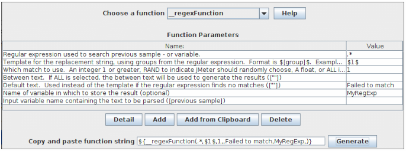

# 20. 函数和变量

JMeter 的函数是一些特殊值，它们可以填充在测试树的任何采样器或其他元件中。函数调用的语法如下：

`${__functionName(var1,var2,var3)}`

其中“\_\_functionName”匹配函数的名称。
圆括号内为函数参数，不同函数的参数也不同，例如 `${__time(YMD)}`。没有参数的函数可以不需要圆括号，例如 `${__threadNum}`。

如果函数的参数包含逗号，需要加上“`\`”来转义，否则 JMeter 会把逗号当做参数的分隔符。例如：

    ${__time(EEE\, d MMM yyyy)}
如果逗号没有被转义——例如 `${__javaScript(Math.max(2,5))}` ——你会得到像这样的错误信息：

    ERROR - jmeter.functions.JavaScript: Error processing Javascript: [Math.max(2] org.mozilla.javascript.EvaluatorException: missing ) after argument list (<cmd>#1)
这是因为字符串“`Math.max(2,5)`”被当做`__javascript` 函数的两个参数： 
`Math.max(2` 和 `5)` 
其他错误信息也是有可能的。

变量的引用如下：

    ${VARIABLE}
**如果引用了未定义的变量或函数，那么 JMeter 并不会报告或者记录错误信息——引用返回值就是引用自身。例如，如果 `UNDEF` 没有被定义为变量，`${UNDEF}` 的返回值就是 `${UNDEF}`。** 变量和函数（包括属性）都是区分大小写的。**JMeter 会剔除变量名称中的空格，例如 `${__Random(1,63, LOTTERY )}` 中的变量‘ `LOTTERY ` ’会被‘`LOTTERY`’取代。**

>属性与变量不一样。变量对线程而言是局部的；属性是针对所有线程的，属性需要使用 `__P` 或 `__property` 函数来引用。

>在 Windows 路径变量（例如 `C:\test\${test}`）前使用 `\` 时，要确保加上 `\` 来转义，否则 JMeter 将不能解释变量，所以要这样写：`C:\\test\\${test}`。  
>还有一种方法，就是使用 `/` 作为路径分隔符，例如 `C:/test/${test}`——Windows 的 JVMs 在必要时会将它转换成路径分隔符。

<p id="functions_list">函数列表，不严格的按类型划分：</p>


|  函数类型   |          名称          |                                              注释                                              | 开始使用版本 |
| ----------- | ---------------------- | ---------------------------------------------------------------------------------------------- | :----------- |
| 信息 | [threadNum](#threadNum)              | 获得线程编号                                                                              | 1.X          |
| 信息 | [threadGroupName](#threadGroupName)  | 获得线程组名称                                                                              | 4.1          |
| 信息 | [samplerName](#samplerName)            | 获得采样器名称（标签）                                                                   | 2.5          |
| 信息 | [machineIP](#machineIP)              | 获得本地 IP 地址                                                               | 2.6          |
| 信息 | [machineName](#machineName)            | 获得本地主机名称                                                                     | 1.X          |
| 信息 | [time](#time)                   | 以各种格式返回当前时间                                                         | 2.2          |
| 信息 | [timeShift](#timeShift)              | 返回各种格式的日期加上指定的秒数/分钟数/小时数/天数或月数 | 3.3          |
| 信息 | [log](#log)                    | 记录（或显示）一条日志（并返回其值）                          | 2.2          |
| 信息 | [logn](#logn)                   | 记录（或显示）一条日志（并返回空值）                                                | 2.2          |
| 输入       | [StringFromFile](#StringFromFile)         | 从文件中读取一行                                                                        | 1.9          |
| 输入       | [FileToString](#FileToString)     |    读取整个文件                                                                            | 2.4          |
| 输入       | [CSVRead](#CSVRead)                | 从 CSV 分隔文件中读取                                                                   | 1.9          |
| 输入       | [XPath](#XPath)                  | 使用 XPath 表达式从文件中读取                                                    | 2.0.3        |
| 计算 | [counter](#counter)                | 	生成递增的数字                                                                | 1.X          |
| 格式化 | [dateTimeConvert](#dateTimeConvert)   | 将日期或时间从源格式转换为目标格式                                            | 4.0          |
| 计算 | [digest](#digest)   | 	生成摘要（SHA-1, SHA-256, MD5...）                                                             | 4.0          |
| 计算 | [intSum](#intSum)                 | 计算整形数（int）的和                                                                                | 1.8.1        |
| 计算 | [longSum](#longSum)                | 计算长整形数（long）的和                                                                               | 2.3.2        |
| 计算 | [Random](#Random)                 | 生成随机数                                                                       | 1.9          |
| 计算 | [RandomDate](#RandomDate)             | 在指定日期范围内生成随机日期                                              | 3.3          |
| 计算 | [RandomFromMultipleVars](#RandomFromMultipleVars) | 从由 <code>\|</code> 分隔的一组变量值中随机提取一个元素                         | 3.1          |
| 计算 | [RandomString](#RandomString)           | 生成随机字符串                                                                       | 2.6          |
| 计算 | [UUID](#UUID)                   | 生成随机的类型为 4 的通用唯一标识符（UUID）                                                                  | 2.9          |
| 脚本   | [groovy](#groovy)                 | 执行 Groovy 脚本                                                                            | 3.1          |
| 脚本   | [BeanShell](#BeanShell)              | 执行 BeanShell 脚本                                                                         | 1.X          |
| 脚本   | [javaScript](#javaScript)             | 处理 JavaScript (Nashorn)                                                                   | 1.9          |
| 脚本   | [jexl2](#jexl2)                  | 执行通用 Jexl2 表达式                                                            | jexl2(2.1.1) |
| 脚本   | [jexl3](#jexl3)                  | 执行通用 Jexl3 表达式                                                            | jexl3 (3.0)  |
| 属性   | [isPropDefined](#isPropDefined)  | 测试属性是否存在                                                            | 4.0  |
| 属性  | [property](#property)               | 读取属性                                                                                | 2.0          |
| 属性  | [P](#P)                      | 读取属性（速记方式）                                                             | 2.0          |
| 属性  | [setProperty](#setProperty)            | 设置 JMeter 属性                                                                  | 2.1          |
| 变量   | [split](#split)                  | 将字符串拆分为变量                                                                  | 2.0.2        |
| 变量   | [eval](#eval)                   | 执行变量表达式                                                                 | 2.3.1        |
| 变量   | [evalVar](#evalVar)                | 存储在变量中的表达式                                                    | 2.3.1        |
| 属性  | [isVarDefined](#isVarDefined)            | 测试变量是否存在                                                          | 4.0          |
| 变量   | [V](#V)                      | 执行变量名称                                                                        | 2.3RC3       |
| 字符串      | [char](#char)                   | 将相应的编码转换成 Unicode 字符值                                            | 2.3.3        |
| 字符串      | [changeCase](#changeCase)        | 改变大小写模式                                          | 2.3.3        |
| 字符串      | [escapeHtml](#escapeHtml)             | 使用 HTML 编码对字符串进行编码                                                             | 2.3.3        |
| 字符串      | [escapeOroRegexpChars](#escapeOroRegexpChars)   | 引用 ORO 正则表达式使用的元字符                                                | 2.9          |
| 字符串      | [escapeXml](#escapeXml)              | 使用 XMl 编码对字符串进行编码                                                              | 3.2          |
| 字符串      | [regexFunction](#regexFunction)          | 使用正则表达式解析之前的响应                                             | 1.X          |
| 字符串      | [unescape](#unescape)               | 将 Java 转义过的字符串（例如 \n & \t）反转义                                         | 2.3.3        |
| 字符串      | [unescapeHtml](#unescapeHtml)           | 将 HTML 编码的字符串解码                                                                    | 2.3.3        |
| 字符串      | [urldecode](#urldecode)              | 对 application/x-www-form-urlencoded 字符串解码                                              | 2.10         |
| 字符串      | [urlencode](#urlencode)              | 将字符串编码成 application/x-www-form-urlencoded 字符串                                  | 2.10         |
| 字符串      | [TestPlanName](#TestPlanName)           | 返回当前测试计划的名称                                                               | 2.6          |

## 20.1 函数可以做什么

JMeter 有两种函数：用户定义的静态值（或变量）和内建函数。  
用户定义的静态值允许用户在编译或者运行测试树时，使用自定义变量来替换静态值。这种替换只在测试运行的开始阶段执行一次。例如，可以用自定义变量来替换所有 HTTP 请求的 DOMAIN 域，这样就使得在不同服务器下执行相同测试的测试变更成为一件简单的事情。

注意，目前变量不支持嵌套，例如 `${Var${N}}` 是无效的，但是可以使用函数 `__V(variable)` 来实现嵌套变量的目的：`${__V(Var${N})}`。同样可以用 `${__BeanShell(vars.get("Var${N}")}` 来实现。

这种类型的替换可以不用函数来实现，但是这样就没有那么方便和直观了。用户可以创建默认配置元件来填充采样器中的空值。变量可以替换任何给定值的一部分，而不只是填充空值。

用户可以通过使用内建函数在运行时根据之前的响应数据、函数所在线程、当前时间和其他资源计算出新的变量值。这些变量值在测试过程中会根据每个请求动态刷新。

>函数被线程共享。在测试计划中每次函数的调用，都由一个单独的函数实例来处理。

## 20.2 函数和变量可以用在哪？

函数和变量可以用在任何测试元件的任何输入域中（除了测试计划——见下文）。有些输入域只接受数字而不支持字符串，因此它们也不支持函数。然而，大多数输入域还是支持函数的。

在测试计划中使用函数是有限制的。当函数被调用时，JMeter 线程变量并没有完全初始化，因此变量名称作为参数传递时也没有初始化，变量会引用失败，所以 `split()` 和 `regex()` 和变量赋值函数都不能正常工作。`threadNum()` 函数也不会工作（它在测试计划层也没有意义）。下面是可以在测试计划中使用的的函数：
* intSum
* longSum
* machineName
* BeanShell
* groovy
* javaScript
* jexl2/jexl3
* random
* time
* property functions
* log functions

配置元件是由独立线程处理的。因此像 `__threadNum` 这样的函数在一些测试元件（例如用户定义的变量）中不能正常地工作。同样要注意在用户定义的变量（UDV）中定义的变量，在（UDV）元件被处理前是不能使用的。

>当在 SQL 代码（或其他）中引用变量/函数时，要记得给文本字符串添加必要的引号，即使用：
>
>       SELECT item from table where name='${VAR}'
>而不是：
>
>       SELECT item from table where name=${VAR}
>
>（除非 `VAR` 本身包含引号）

## 20.3 如何引用变量和函数

在测试元件中引用一个变量可以通过使用 `${` 和 `}` 将变量名称括起来实现。

函数引用的方法相同，但是按照惯例，函数名称以“`__`”开头来和变量名称区分开。一些函数带参数，参数放在圆括号中，用逗号分隔。如果函数不带参数，可以省略圆括号。

**如果参数本身带逗号，必须将其转义。可以使用‘`\,`’来转义。** 这适用于例如脚本函数 - Javascript，Beanshell，Jexl，groovy - 有必要对所有脚本函数调用中的逗号加以转义，例如：

    ${__BeanShell(vars.put("name"\,"value"))}
换一种方法，你也可以将你的脚本定义为一个变量，例如在测试计划中定义：

    SCRIPT          vars.put("name","value")
定义过的脚本可以像下面这样被引用：

    ${__BeanShell(${SCRIPT})}
在 `SCRIPT` 变量中就没有必要对逗号进行转义了，因为函数的调用在变量用其值替换之前被解析。该方法适用于 JSR223 或者 BeanShell 采样器，这两种采样器可用来测试 Javascript，Jexl 和 BeanShell 脚本。

函数可以引用参数和其他函数，例如 `${__XPath(${__P(xpath.file),${XPATH})}` 使用“`xpath.file`”的值作为文件名，使用变量 `XPATH` 的内容作为搜索表达式。

JMeter 提供一个工具来帮助建立各种内置函数的函数调用，只需使用复制-粘贴就可以实现。它不会自动为你转义，因为函数可以作为其他函数的参数，应该只对文本内容进行转义。

>如果一个字符串既包含反斜杠（‘`\`’）又包含函数或者变量引用，出现在‘`$`’或‘`,`’或‘`\`’之前的反斜杠会被移除。这种操作对于包含逗号或者 `${` 的嵌套函数是有必要的。如果一个字符串不包含函数或者变量引用，那么在‘`$`’或‘`,`’或‘`\`’之前的反斜杠不会被移除。

**变量或函数的值可以用 [`__logn()`](#logn) 函数来报告**，`__logn()` 函数在要报告的变量被定义之后可以在测试计划的任何地方被引用。除此之外，Java 请求采样器可以用来生成一个包含变量引用的采样；其输出能在合适的监听器中显示。注意也可以通过在查看结果树中使用 [Debug Sampler](http://jmeter.apache.org/usermanual/component_reference.html#Debug_Sampler) 来显示变量的值。

>如果用和内建函数同样的名称定义一个用户静态变量，那么定义的静态变量将覆盖同名内建函数。

## 20.4 函数助手对话框

函数助手对话框可以在 JMeter 的工具菜单中找到。

    
  _函数助手对话框_

使用函数助手，可以从下拉列表中选择一个函数，并给它的参数赋值。表格左列是参数的简要说明，表格的右列填入相应参数的值。不同的函数有不同的参数。

上述操作完成之后，点击“生成（Generate）”按钮，相应调用函数的字符串就生成了，你可以复制-粘贴到测试计划中的任何地方。

## 20.5 函数

<h3 id="regexFunction">__regexFunction</h3>

regexFunction 函数可以使用任意正则表达式（用户提供的）来解析之前的服务器响应（或变量值）。函数返回填充了变量值的模版字符串。

`__regexFunction` 也可以存储值供以后使用。你可以在它的第六个参数中设定一个引用名称。在函数执行之后，可以使用用户定义的值的语法在稍后时间检索相同的值。例如，如果输入 “`refName`” 作为第六个参数，那么可以使用：
* `${refName}` 来引用该函数解析的第二个参数（“替换字符串的模版”）的计算结果
* `${refName_g0}` 来引用该函数解析的整个匹配
* `${refName_g1}` 来引用该函数解析的第一个匹配组合
* `${refName_g#}` 来引用该函数解析的第 N 个匹配组合
* `${refName_matchNr}` 来引用该函数解析的匹配组合数量

>如果是分布式测试，要切换模式（见 `jmeter.properties`）确保它不在剥离模式下，参见 [`Bug 56376`](https://bz.apache.org/bugzilla/show_bug.cgi?id=56376)。

**参数（Parameters）**

属性（Attribute）| 描述| 是否必须
---------|----------|---------
 第一个参数 | 第一个参数是解析响应数据的正则表达式。它会抓取所有匹配。请在模版字符串中给该表达式中想要使用的部分加上括号。例如：`<a href="(.*)">`。它将抓取链接值并储存在第一个匹配组合中（这里只有一个匹配组合）。另一个例子：`<input type="hidden" name="(.*)" value="(.*)">`。它将抓取 name 的值作为第一个匹配组合，value 的值作为第二个匹配组合。这些匹配的值可以用在模版字符串中。| 是
 第二个参数| 这是一个运行时会替换函数的模版字符串。要引用正则表达式中捕获的匹配组合，使用下面的句法：`$[group_number]$`。例如 `$1$` 或者 `$2$`。你的模版可以是任意字符串。 |是
 第三个参数 | 第三个参数告诉 JMeter 使用第几个匹配。你的正则表达式可能找到多个匹配。对此有四个选项：<br/><ul><li> 整数——直接告诉 JMeter 使用第几个匹配。‘`1`’对应第一个，‘`2`’对应第二个，以此类推。 </li><li> `RAND`——告诉 JMeter 使用随机匹配。</li><li> `ALL`——告诉 JMeter 使用所有匹配，对应每个匹配生成一个模版字符串并将它们组合到一起。这个选项很少用到。</li><li> 0 到 1 之间的浮点数——告诉 JMeter 根据公式（总的匹配个数*浮点值）计算使用第几个匹配项，计算值向最近的整数取整</li></ul> | 否，默认值 = 1
 第四个参数 | 如果上一个参数选择 `ALL`，这个参数会被插入到每个附加的模版值副本之间 | 否
 第五个参数 | 如果没有匹配项返回的默认值| 否
 第六个参数 | 重用此函数解析的值的引用名称,储存的值包括 `${refName}`（替换的模版字符串）和 `${refName_g#}` ,其中“`#`”代表正则表达式匹配分组的序号（“`0`”可以用来引用整个匹配） | 否
 第七个参数 | 输入变量名称。如果指定了这个参数，那么将使用变量的值作为输入，而不是使用之前的采样结果。 | 否

[【返回标题】](#20-函数和变量) [【返回函数列表】](#functions_list)

<h3 id="counter">__counter</h3>

计数器每次调用会生成一个新值，从 1 开始，每次加 1。计数器可以配置成对每个虚拟用户独立的，也可以配置成对所有用户公用的。如果每个用户的值分开计数，通常用于计算测试计划的执行次数。全局计数器通常用于计算请求的次数。

计数器使用一个整型变量来保存计数，允许的最大值为 2,147,483,647。

计数器函数实例是完全独立的。全局计数器 - “`FALSE`” - 的每个实例都是独立维护的。

**`__counter` 函数在同一个迭代中的多次调用不会进一步增加值。** 
如果您想对每个采样器计数，请使用前置处理器（例如[用户参数](http://jmeter.apache.org/usermanual/component_reference.html#User_Parameters)）中的功能。

**参数（Parameters）**

属性（Attribute）| 描述| 是否必须
---------|----------|---------
第一个参数 | `TRUE` 如果您希望每个虚拟用户的计数器保持独立并与其他用户分开。 `FLASE` 全局计数器。 | 是
第二个参数 | 重用此函数创建的值的引用名称。<br/>存储的值的格式为 `${refName}`。这允许你保留一个计数器，并在多个地方引用它的值。 | 否

[【返回标题】](#20-函数和变量) [【返回函数列表】](#functions_list)

<h3 id="threadNum">__threadNum</h3>

threadNum 函数只是返回当前正在执行的线程编号。线程编号独立于线程组，这意味着从该函数的角度来看，一个线程组中的线程 #1 与另一个线程组中的线程 #1 是没有区别的。

这个函数没有参数。

用法示例：

    ${__threadNum}
返回 1 到线程组中配置的运行线程的最大值之间的数字。

>这个函数在任何配置元件（例如用户定义的变量）中都不起作用，因为它们是在一个单独的线程中运行的。在测试计划中也不能使用。

[【返回标题】](#20-函数和变量) [【返回函数列表】](#functions_list)

<h3 id="threadGroupName">__threadGroupName</h3>

threadGroupName 函数只返回正在执行的线程组的名称。 

这个函数没有参数。

用法示例：

```
${__threadGroupName}
```

> 这个函数在任何配置元件（例如用户定义的变量）中都不起作用，因为它们是在一个单独的线程中运行的。在测试计划中也不能使用。

[【返回标题】](#20-函数和变量) [【返回函数列表】](#functions_list)

<h3 id="intSum">__intSum</h3>

intSum 函数可用于计算两个或更多个整数值之和。

>引用名称是可选的，但不能是有效的整数。

**参数（Parameters）**

属性（Attribute）| 描述| 是否必须
---------|----------|---------
第一个参数 | 第一个整数值 | 是
第二个参数 | 第二个整数值 | 是
第 n 个参数 | 第 n 个整数值 | 否
最后一个参数 | 重用此函数计算值的引用名称。如果该参数被指定，引用名称必须包含至少一个非数字字符，否则将被视为另一个要添加的整数值 | 否

例子：

    ${__intSum(2,5,MYVAR)}
将返回 7（2 + 5）并将结果存储在 MYVAR 变量中。所以 `${MYVAR}` 将等于 7。

    ${__intSum(2,5,7)}
将返回 14（2 + 5 + 7）并将结果存储在 MYVAR 变量中。

    ${__intSum(1,2,5,${MYVAR})}
如果 MYVAR 值等于 8，1 + 2 + 5 + ${MYVAR}，返回 16。

[【返回标题】](#20-函数和变量) [【返回函数列表】](#functions_list)

<h3 id="longSum">__longSum</h3>

longSum 函数可用于计算两个或更多个长整型值之和，当计算值不在 -2147483648 到 2147483647 之间，使用此函数而不是 __intSum。

**参数（Parameters）**

属性（Attribute）| 描述| 是否必须
---------|----------|---------
第一个参数 | 第一个长整型值 | 是
第二个参数 | 第二个长整型值 | 是
第 n 个参数 | 第 n 个长整型值 | 否
最后一个参数 | 重用此函数计算值的引用名称。如果该参数被指定，引用名称必须包含至少一个非数字字符，否则将被视为另一个要添加的长整型值 | 否

例子：

    ${__longSum(2,5,MYVAR)}
将返回 7（2 + 5）并将结果存储在 MYVAR 变量中。所以 `${MYVAR}` 将等于 7。

    ${__longSum(2,5,7)}
将返回 14（2 + 5 + 7）并将结果存储在 MYVAR 变量中。

    ${__longSum(1,2,5,${MYVAR})}
如果 MYVAR 值等于 8，1 + 2 + 5 + ${MYVAR}，返回 16。 

[【返回标题】](#20-函数和变量) [【返回函数列表】](#functions_list)

<h3 id="StringFromFile">__StringFromFile</h3>

StringFromFile 函数可以用来从文本文件中读取字符串。这对于运行需要大量可变数据的测试非常有用。例如，在测试银行应用程序时，可能需要 100 或 1000 个不同的帐号。

另请参阅可能更易于使用的 [CSV Data Set Config 测试元件](http://jmeter.apache.org/usermanual/component_reference.html#CSV_Data_Set_Config)。但是，目前不支持多个输入文件。

每次调用该函数都会从文件中读取下一行。所有的线程共享相同的实例，所以不同的线程会读取不同的行。到达文件末尾时，除非达到最大循环次数，否则将从头开始重新读取。如果在一个测试脚本中引用该函数多次，每此引用都将独立打开文件，即使文件名相同。（如果要在其他地方再次使用该值，请为每个函数调用使用不同的变量名称。）

>函数实例在线程之间共享，并且无论线程​​是否需要下一行输入，该文件都会（重新）打开，因此使用 `threadNumber` 作为文件名的一部分将导致不可预知的行为。

如果打开或读取文件时发生错误，函数会返回字符串“`**ERR**`”。

**参数（Parameters）**

属性（Attribute）| 描述| 是否必须
---------|----------|---------
文件名称 | 文件名称的路径。（可以使用相对于 JMeter 启动目录的相对路径）如果要使用可选的序列号，路径名称应该适合转换成十进制格式。看下面的例子。 | 是
变量名称 | 引用名称 - `refName` - 用于重用由此函数创建的值。存储该值的格式为 `${refName}`。默认值是“`StringFromFile_`”。 | 否
开始序列号 | 初始序列号（如果省略，结束序列号将被视为循环计数） | 否
结束序列号 | 终止序列号（如果省略，序列号可以不受限制地增加下去） | 否

文件名称参数在文件打开或重新打开时被解析。

引用名称参数（如果支持）在每次执行函数时被解析。

**使用序列号：**

使用可选的序列号时，路径名称将使用 `java.text.DecimalFormat` 的格式字符串。当前的序列号将作为唯一的参数传入。如果没有指定可选的开始序列号，就使用路径名称作为起始值。有用的格式序列如下：

`#`

  * 插入不带前导零或空格的数字

`000` 

  * 插入带有前导零的三位数字，如果需要的话

> <h4>格式字符串的使用</h4>
> 
> 以下是几个格式字符串以及它们将生成的对应序列。
>
> `pin#'.'dat`
>
> * 生成不带前导零的序列，`.` 还是 `.`：`pin1.dat`，...，`pin9.dat`，`pin10.dat`，...，`pin9999.dat`
>
> `pin000'.'dat`
>
> * 生成带前导零的序列，同时保持 `.`。当数字位数超过三位时，序列将使用更多位数的数字：`pin001.dat`，... `pin099.dat`，...，`pin999.dat`，...，`pin9999.dat`
>
> `pin'.'dat#`
>
> * 生成不带前导零的附加数字，同时保持 `.`：`pin.dat1`，...，`pin.dat9`，...，`pin.dat999`

如果需要的位数多于格式字符数，数字将根据需要进行扩展。
**要防止格式字符被解释，请将其包含在单引号中。请注意，“`.`”是一个格式字符，必须用单引号引起来** （尽管 `#.` 和 `000.` 在工作区能按预期的方式工作，因为它被视为小数点，而小数点也是“`.`”）。
在其他语言环境（例如 `fr`）中，小数点是“`,`” - 这意味着“`#.`”会变成“`nnn,`”。
有关完整的细节，请参阅 DecimalFormat （十进制格式）的文档。
如果路径名称不包含任何特殊的格式字符，则将当前的序号直接附加到名称上，否则将根据格式化指令插入数字。 
如果起始序列号被忽略，并且指定了结束序列号，则结束序列号将被解释为循环计数，并且该文件将被使用循环计数的最大次数。在这种情况下，文件名不是格式化的。
`${__StringFromFile(PIN#'.'DAT,,1,2)}` 读取 `PIN1.DAT`, `PIN2.DAT` 
`${__StringFromFile(PIN.DAT,,,2)}` 读取 `PIN.DAT` 两次 
注意上面 `PIN.DAT` 中的“`.`”不应被引号包含。在这种起始序列号被省略的情况下，文件名完全按原样使用。

[【返回标题】](#20-函数和变量) [【返回函数列表】](#functions_list)

<h3 id="machineName">__machineName</h3>

machineName 函数返回本地主机名称。它使用 Java 方法 `InetAddress.getLocalHost()` 并将值传递给 `getHostName()`。

**参数（Parameters）**

属性（Attribute）| 描述| 是否必须
---------|----------|---------
变量名称 | 重用此函数计算的值的引用名称 | 否

例子：

    ${__machineName()}

返回机器的主机名称

    ${__machineName}

返回机器的主机名称

[【返回标题】](#20-函数和变量) [【返回函数列表】](#functions_list)

<h3 id="machineIP">__machineIP</h3>

machineIP 函数返回本地 IP 地址。它使用 Java 方法`InetAddress.getLocalHost()` 并将其值传递给 `getHostAddress()`。

**参数（Parameters）**

属性（Attribute）| 描述| 是否必须
---------|----------|---------
变量名称 | 重用此函数计算的值的引用名称 | 否

例子：

    ${__machineIP()}

返回机器的 IP 地址

    ${__machineIP}

返回机器的 IP 地址

[【返回标题】](#20-函数和变量) [【返回函数列表】](#functions_list)

<h3 id="javaScript">__javaScript</h3>

javaScript 函数执行一段 JavaScript（不是 Java！）代码并返回它的值。

JMeter Javascrip t函数调用独立的 JavaScript 解释器。Javascript 被当作脚本语言使用，所以可以做相应的计算等。

>在 JMeter 中，javaScript 并不是最好的脚本语言。如果你的测试计划需要大量的线程，建议使用`__jexl3` 或`__groovy` 函数。

对于 Nashorn 引擎，请参阅[ Java 平台标准版 Nashorn 用户指南](https://docs.oracle.com/javase/8/docs/technotes/guides/scripting/nashorn/)。

对于 Rhino 引擎，请参阅[Mozilla Rhino 概述](http://www.mozilla.org/rhino/overview.html)。

以下变量可用于脚本：
  * `log` - 函数的[记录](https://www.slf4j.org/api/org/slf4j/Logger.html)
  * `ctx` - [JMeterContext](http://jmeter.apache.org/api/org/apache/jmeter/threads/JMeterContext.html) 对象
  * `vars` - [JMeterVariables](http://jmeter.apache.org/api/org/apache/jmeter/threads/JMeterVariables.html) 对象
  * `threadName` - 包含当前线程名称的字符串
  * `sampler` - 当前[采样器](http://jmeter.apache.org/api/org/apache/jmeter/samplers/Sampler.html)对象（如果有的话）
  * `samplerResult` - 之前的 [SampleResult](http://jmeter.apache.org/api/org/apache/jmeter/samplers/SampleResult.html) 对象（如果有的话）
  * `props` - JMeterProperties（类 [java.util.Properties](https://docs.oracle.com/javase/8/docs/api/java/util/Properties.html)）对象

Rhinoscript 允许通过其 Packages 对象访问静态方法。请参阅 [Java 脚本](https://wiki.openjdk.java.net/display/Nashorn/Rhino+Migration+Guide) 文档。例如，可以像这样访问 JMeterContextService 静态方法：`Java.type("org.apache.jmeter.threads.JMeterContextService").getTotalThreads()`。

>JMeter 不是浏览器，不能解释下载页面中的 JavaScript。

**参数（Parameters）**

属性（Attribute）| 描述| 是否必须
---------|----------|---------
表达式 | 要执行的JavaScript表达式。例如：<br/><ul><li>`new Date()` - 返回当前日期和时间</li><li>`Math.floor(Math.random()*(${maxRandom}+1))` - 一个介于 `0` 和变量 `maxRandom` 之间的随机数</li><li>`${minRandom}+Math.floor(Math.random()*(${maxRandom}-${minRandom}+1))` - 介于变量 `minRandom` 和 `maxRandom` 之间的随机数</li><li>`"${VAR}"=="abcd"`</li></ul> | 是
变量名称 | 重用此函数计算的值的引用名称 | 否

>请记住为文本字符串和 JMeter 变量添加必要的引号。另外，如果表达式有逗号，请确保将其转义。例如：
>
>     ${__javaScript('${sp}'.slice(7\,99999))}
>
> `7` 之后的逗号被转义了。

例子：

    ${__javaScript(new Date())}

返回 `Sat Jan 09 2016 16:22:15 GMT+0100 (CET)` 

    ${__javaScript(new Date(),MYDATE)}

返回 `Sat Jan 09 2016 16:22:15 GMT+0100 (CET)` 并将其存储在变量 `MYDATE` 下 

    ${__javaScript(Math.floor(Math.random()*(${maxRandom}+1)),MYRESULT)}

使用 `maxRandom` 变量，返回 `0` 和 `maxRandom` 之间的随机值并将其存储在  `MYRESULT` 中

    ${__javaScript(${minRandom}+Math.floor(Math.random()*(${maxRandom}-${minRandom}+1)),MYRESULT)}

使用 `maxRandom` 和 `minRandom` 变量，返回 `maxRandom` 和 `minRandom` 之间的随机值并将其存储在 `MYRESULT` 中

    ${__javaScript("${VAR}"=="abcd",MYRESULT)}

将 `VAR` 变量的值与 `abcd` 进行比较，返回 `true` 或 `false` 并将结果存储在 `MYRESULT` 中

[【返回标题】](#20-函数和变量) [【返回函数列表】](#functions_list)

<h3 id="Random">__Random</h3>

random 函数返回一个介于给定最小值和最大值之间的随机数。

**参数（Parameters）**

属性（Attribute）| 描述| 是否必须
---------|----------|---------
最小值 | 一个数字 | 是
最大值 | 一个更大的数字 | 是
变量名称 | 重用此函数计算的值的引用名称 | 否

例子：

    ${__Random(0,10)}

返回一个 0 到 10 之间的随机数

    ${__Random(0,10, MYVAR)}

返回一个 0 到 10 之间的随机数，并将其存储在 `MYVAR`中。`${MYVAR}`将包含此随机数。

[【返回标题】](#20-函数和变量) [【返回函数列表】](#functions_list)

<h3 id="RandomDate">__RandomDate</h3>

RandomDate 函数返回一个位于给定开始日期和结束日期值之间的随机日期。

**参数（Parameters）**

属性（Attribute）| 描述| 是否必须
---------|----------|---------
时间格式 | DateTimeFormatter 的格式字符串（默认为 `yyyy-MM-dd`） | 否
开始日期 | 开始日期，默认值是现在 | 否
结束日期 | 结束日期 | 是
用于格式的区域设置 | 语言环境的字符串格式。语言代码必须是小写。国家代码必须大写。分隔符必须是下划线，例如 `en_EN`。请参阅 [http://www.oracle.com/technetwork/java/javase/javase7locales-334809.html]( http://www.oracle.com/technetwork/java/javase/javase7locales-334809.html)。如果省略，则默认情况下该函数使用 Apache JMeter 当前语言环境。 | 否
变量名称 | 要设置的变量名称 | 否

例子：

    ${__RandomDate(,,2050-07-08,,)}

返回从现在到 `2050-07-08` 之间一个随机的日期。例如 `2039-06-21` 

    ${__RandomDate(dd MM yyyy,,08 07 2050,,)}

将返回一个自定义格式的随机日期，例如 `04 03 2034`

[【返回标题】](#20-函数和变量) [【返回函数列表】](#functions_list)

<h3 id="RandomString">__RandomString</h3>

RandomString 函数返回一个 chars 长度内的随机字符串。

**参数（Parameters）**

属性（Attribute）| 描述| 是否必须
---------|----------|---------
长度 | 生成字符串的长度 | 是
使用的字符 | 用于生成字符串的字符 | 否
变量名称 | 重用此函数计算的值的引用名称 | 否

例子：

    ${__RandomString(5)}

返回随机的可读或不可读的 5 个字符

    ${__RandomString(10,abcdefg)}

将返回从 `abcdefg` 集合中挑选的 10 个字符的随机字符串，如 `cdbgdbeebd` 或 `adbfeggfad`，...

    ${__RandomString(6,a12zeczclk, MYVAR)}

从 `a12zeczclk` 集合中返回一个由 6 个字符组成的随机字符串，并将结果存储在 `MYVAR` 中，`MYVAR` 将包含像 `2z22ak` 或 `z11kce` 这样的字符串，...

[【返回标题】](#20-函数和变量) [【返回函数列表】](#functions_list)

<h3 id="RandomFromMultipleVars">__RandomFromMultipleVars</h3>

RandomFromMultipleVars 函数根据`源变量`提供的变量值返回一个随机值。

变量可以是单值或多值的，它们可以由以下提取器生成：
  * [边界提取器](http://jmeter.apache.org/usermanual/component_reference.html#Boundary_Extractor)
  * [正则表达式提取器](http://jmeter.apache.org/usermanual/component_reference.html#Regular_Expression_Extractor)
  * [CSS 提取器](http://jmeter.apache.org/usermanual/component_reference.html#CSS_Selector_Extractor)
  * [JSON 提取器](http://jmeter.apache.org/usermanual/component_reference.html#JSON_Extractor)
  * [XPath 提取器](http://jmeter.apache.org/usermanual/component_reference.html#XPath_Extractor)
  * [XPath2 提取器](http://jmeter.apache.org/usermanual/component_reference.html#XPath2_Extractor)

多值变量就是，当你设置 `-1` 作为`匹配数字`所提取的值。当n = 1，2，3...时会创建相应匹配号变量 `varName_matchNr`，并为每个值创建变量 `varName_n`，其中n = 1，2，3 等 。

**参数（Parameters）**

属性（Attribute）| 描述| 是否必须
---------|----------|---------
源变量 | 变量名称包含的值将用作随机计算的输入，用 <code>\|</code> 分隔 | 是
变量名称 | 重用此函数计算的值的引用名称 | 否

例子：

    ${__RandomFromMultipleVars(val)}

根据变量 val 的内容返回一个随机的字符串，不管它们是否是多值的

    ${__RandomFromMultipleVars(val1|val2)}

根据变量 val1 和 val2 的内容返回一个随机字符串，不管它们是否为多值

    ${__RandomFromMultipleVars(val1|val2, MYVAR)}

根据变量 val1 和 val2 的内容返回一个随机字符串，不管它们是否为多值，并将结果存储在 `MYVAR` 中 

[【返回标题】](#20-函数和变量) [【返回函数列表】](#functions_list)

<h3 id="UUID">__UUID</h3>

UUID 函数返回伪随机类型为 4 的通用唯一标识符（UUID）。

没有参数。

例子：

    ${UUID()}

将返回具有以下格式的 UUID：`c69e0dd1-ac6b-4f2b-8d59-5d4e8743eecd`

[【返回标题】](#20-函数和变量) [【返回函数列表】](#functions_list)

<h3 id="CSVRead">__CSVRead</h3>

CSVRead 函数从 CSV 文件返回一个字符串（注意与 [StringFromFile](#StringFromFile) 的区别）。

注：JMeter 支持多个文件名。

**大多数情况下，较新的 [CSV Data Set Config 元件](http://jmeter.apache.org/usermanual/component_reference.html#CSV_Data_Set_Config)更容易使用。**

第一次读取某个文件名时，文件被打开并读取到内部数组。空行将被视为文件结尾——这允许使用尾部注释。

后续对同一文件名的所有引用使用相同的内部数组。注意，文件名是区分大小写的，即使操作系统不区分大小写，所以 `CSVRead(abc.txt,0)` 和 `CSVRead(aBc.txt,0)` 会引用不同的内部数组。

`*ALIAS` 功能允许同一个文件被打开多次，并且允许较短的文件名。

每个线程都有自己的内部指针，指向文件数组中的当前行。当一个线程第一次引用文件时，它将被分配到数组中的下一个空闲行，所以每个线程将访问与其他所有线程不同的行（除非线程数多于数组中的行）。

>该函数默认情况下以逗号分割行。如果要输入包含逗号的列，需要通过设置 `csvread.delimiter` 属性将分隔符更改为不出现在任何列数据中的字符。

**参数（Parameters）**

属性（Attribute）| 描述| 是否必须
---------|----------|---------
文件名称 | 要读取的文件（或 `*ALIAS`） | 是
列号 | 文件中的列号。 `0` 为第一列，`1`为第二列，以此类推。"`next`" - 转到文件的下一行。 `*ALIAS` - 打开一个文件并指派一个别名 | 是


例如，你可以设置一些变量如下：
  * COL1a `${__CSVRead(random.txt,0)}`
  * COL2a `${__CSVRead(random.txt,1)}${__CSVRead(random.txt,next)}`
  * COL1b `${__CSVRead(random.txt,0)}`
  * COL2b `${__CSVRead(random.txt,1)}${__CSVRead(random.txt,next)}`

这将从一行中读取两列，从下一行中读取两列。如果所有变量都在相同的前置处理器的用户参数上定义，那么这些行将是连续的。否则的话，另外一个线程可能会读取下一行。

>该函数不适用于大文件，因为它会将整个文件存储在内存中。对于较大的文件，请使用 [CSV Data Set Config 元件](http://jmeter.apache.org/usermanual/component_reference.html#CSV_Data_Set_Config) 或 [StringFromFile](#StringFromFile)。

[【返回标题】](#20-函数和变量) [【返回函数列表】](#functions_list)

<h3 id="property">__property</h3>

property 函数返回 JMeter 属性的值。如果找不到属性值，并且没有提供默认值，则返回属性名称。当提供默认值时，可以不需要函数名称——参数可以设置为 null，并且将被忽略。

例如：
  * `${__property(user.dir)}` - 返回 `user.dir` 的值
  * `${__property(user.dir,UDIR)}` - 返回 `user.dir` 的值并保存在 `UDIR` 中
  * `${__property(abcd,ABCD,atod)}` - 返回属性 `abcd` 的值（如果没有定义，则返回“`atod`”）并保存在 `ABCD` 中
  * `${__property(abcd,,atod)}` - 返回属性 `abcd`的值（如果未定义，则返回“`atod`”）但不保存

**参数（Parameters）**

属性（Attribute）| 描述| 是否必须
---------|----------|---------
属性名称 | 要检索的属性名称 | 是
变量名称 | 重用此函数计算的值的引用名称 | 否
默认值 | 属性的默认值 |  否

[【返回标题】](#20-函数和变量) [【返回函数列表】](#functions_list)

<h3 id="P">__P</h3>

这是一个简化的属性函数，用于在命令行中定义的属性。与`__property` 函数不同，没有选项可将值保存在变量中，如果未提供默认值，则假定为 1。选择 1 作为假定默认值是因为它对于常见测试变量如循环次数，线程数，加速等都有效。

例如：

定义属性值：

    jmeter -Jgroup1.threads=7  -Jhostname1=www.realhost.edu
获取值：
  * `${__P(group1.threads)}` - 返回 `group1.threads` 的值
  * `${__P(group1.loops)}` - 返回 `group1.loops` 的值
  * `${__P(hostname,www.dummy.org)}` - 返回属性的值的 `hostname`（主机名）或 `www.dummy.org` 。如果在上面的例子中没有定义，第一个函数调用将返回`7`，第二个返回 `1`，最后一个将返回 `www.dummy.org` （除非这些属性在别处有定义！）

**参数（Parameters）**

属性（Attribute）| 描述| 是否必须
---------|----------|---------
属性名称 | 要检索的属性名称 | 是
默认值 | 属性的默认值。如果省略，则默认为“`1`”。 | 否

[【返回标题】](#20-函数和变量) [【返回函数列表】](#functions_list)

<h3 id="log">__log</h3>

log 函数记录一条日志，并返回它的输入字符串。

**参数（Parameters）**

属性（Attribute）| 描述| 是否必须
---------|----------|---------
要记录的字符串 | 一个字符串 | 是
日志级别 | `OUT`，`ERR`，`DEBUG`，`INFO`（默认），`WARN`或`ERROR` | 否
可丢弃的文本 | 如果非空，则创建一个可丢弃的文本传递给记录器 | 否
注释 | 如果存在，则显示在字符串中。用于标识正在记录的内容。 | 否

`OUT` 和 `ERR` 日志级别会直接输出记录到 `System.out` 和 `System.err`。这种情况下，输出始终会被打印——它不依赖于当前的日志设置。
  * `${__log(Message)}` 写入日志文件,形如“`… thread Name : Message`”
  * `${__log(Message,OUT)}` 写到控制台窗口
  * `${__log(${VAR},,,VAR=)}` 写入日志文件，形如“`… thread Name VAR=value`”

[【返回标题】](#20-函数和变量) [【返回函数列表】](#functions_list)

<h3 id="logn">__logn</h3>

logn 函数记录一条日志，并返回空字符串。

**参数（Parameters）**

属性（Attribute）| 描述| 是否必须
---------|----------|---------
要记录的字符串 | 一个字符串 | 是
日志级别 | `OUT`，`ERR`，`DEBUG`，`INFO`（默认），`WARN`或`ERROR` | 否
可丢弃的文本 | 如果非空，则创建一个可丢弃的文本传递给记录器 | 否

`OUT` 和 `ERR` 日志级别会直接输出记录到 `System.out` 和 `System.err`。这种情况下，输出始终会被打印——它不依赖于当前的日志设置。
  * `${__logn(VAR1=${VAR1},OUT)}` 将变量的值写到控制台窗口

[【返回标题】](#20-函数和变量) [【返回函数列表】](#functions_list)

<h3 id="BeanShell">__BeanShell</h3>

BeanShell 函数执行传递给它的脚本，并返回结果。

> 为了更好的性能，请使用[`__groovy`](#groovy)函数 

**有关使用 BeanShell 的完整详细信息，请参考 BeanShell 网站：[http://www.beanshell.org/](http://www.beanshell.org/)**

>注意，测试脚本中每个独立的函数调用都使用不同的解释器，但是后续的调用使用相同的解释器。这意味着变量在不同的函数的调用中会持续存在。

单个函数实例可以从多个线程中调用。但是函数 `execute()` 的方法是同步的。

如果属性“`beanshell.function.init`”已被定义，则将其作为源文件传递给解释器。这可以用来定义通用的方法和变量。在 bin 目录中有一个 init 示例文件：`BeanShellFunction.bshrc`。

以下变量在脚本执行之前已经被设置：
  * `log` - BeanShell 函数（*）的[记录器](https://www.slf4j.org/api/org/slf4j/Logger.html)
  * `ctx` - [JMeterContext](http://jmeter.apache.org/api/org/apache/jmeter/threads/JMeterContext.html) 对象
  * `vars` - [JMeterVariables](http://jmeter.apache.org/api/org/apache/jmeter/threads/JMeterVariables.html) 对象
  * `props` - JMeterProperties（类 [java.util.Properties](https://docs.oracle.com/javase/8/docs/api/java/util/Properties.html)）对象
  * `threadName` - 线程名称 （字符串）
  * `Sampler` - 当前的[采样器](http://jmeter.apache.org/api/org/apache/jmeter/samplers/Sampler.html)，如果有的话
  * `SampleResult` - 当前的 [SampleResult](http://jmeter.apache.org/api/org/apache/jmeter/samplers/SampleResult.html)，如果有的话

（*）表示这是在 init 文件（如果有的话）被处理之前设置的。其他变量因调用而异。
**参数（Parameters）**

属性（Attribute）| 描述| 是否必须
---------|----------|---------
BeanShell 脚本 | BeanShell 脚本（不是文件名） | 是
变量名称 | 重用此函数计算的值的引用名称 | 否

例子：
  * `${__BeanShell(123*456)}` 返回 `56088`
  * `${__BeanShell(source("function.bsh"))}` 在 `function.bsh` 中处理脚本

>请记住为文本字符串和表示文本字符串的 JMeter 变量添加必要的引号。

[【返回标题】](#20-函数和变量) [【返回函数列表】](#functions_list)

<h3 id="groovy">__groovy</h3>

groovy 函数执行 [Apache Groovy](http://groovy-lang.org/) 传递给它的脚本，并返回结果。

如果属性“`groovy.utilities`”已被定义，它会被 ScriptEngine（脚本引擎）加载。这可以用来定义通用的方法和变量。在 bin 目录中有一个 init 示例文件：`utility.groovy`。

以下变量在脚本执行之前已经被设置：
  * `log` - groovy 函数（*）的[记录器](https://www.slf4j.org/api/org/slf4j/Logger.html)
  * `ctx` - [JMeterContext](http://jmeter.apache.org/api/org/apache/jmeter/threads/JMeterContext.html) 对象
  * `vars` - [JMeterVariables](http://jmeter.apache.org/api/org/apache/jmeter/threads/JMeterVariables.html) 对象
  * `props` - JMeterProperties（类 [java.util.Properties](https://docs.oracle.com/javase/8/docs/api/java/util/Properties.html)）对象
  * `threadName` - 线程名称 （字符串）
  * `Sampler` - 当前的[采样器](http://jmeter.apache.org/api/org/apache/jmeter/samplers/Sampler.html)，如果有的话
  * `prev` - 之前的 [SampleResult](http://jmeter.apache.org/api/org/apache/jmeter/samplers/SampleResult.html)，如果有的话
  * `OUT` - System.out

（*）表示这是在 init 文件（如果有的话）被处理之前设置的。其他变量因调用而异。

> 使用此函数时，请使用之前定义的变量而不是使用字符串替换来访问脚本中的变量。遵循此模式以确保缓存Groovy，从而确保您的测试具有高效性。 

例如**，不要**执行以下操作： 

    ${__groovy("${myVar}".substring(0\,2))}

想象一下，变量myVar随每个事务而变化，上面的Groovy无法缓存，因为脚本每次都会更改。
但是执行下面的操作，就可以缓存：

    ${__groovy(vars.get("myVar").substring(0\,2))}

**参数（Parameters）**

属性（Attribute）| 描述| 是否必须
---------|----------|---------
要计算的表达式 | 一个 groovy 脚本（不是文件名）<br/><blockquote>本身包含逗号的参数值应根据需要进行转义。如果需要在参数值中包含逗号，请像这样转义： ‘`\,`’</blockquote> | 是
变量名称 | 重用此函数计算的值的引用名称 | 否

例子：

    ${__groovy(123*456)}

返回 `56088`

    ${__groovy("${var}".substring(0\,2))}

如果 var 的值是 `JMeter`，它会在调用 `String.substring(0,2)` 后返回 `JM`。注意 `,` 已经被 `\,` 转义。

> 请记住为文本字符串和表示文本字符串的 JMeter 变量添加必要的引号。

[【返回标题】](#20-函数和变量) [【返回函数列表】](#functions_list)

<h3 id="split">__split</h3>

split 函数根据分隔符拆分传递给它的字符串，并返回原始字符串。如果分隔符与分隔符是相邻的，则返回“`？`”作为值。拆分出来的字符串将返回到 `${VAR_1}`，`${VAR_2}`……这些变量中。变量的计数将返回到 `${VAR_n}` 中。拖尾分隔符被视为缺失变量，并返回“`？`”。此外，为了使它在 ForEach 控制器上更好地工作， `__split` 现在会删除第一个不使用的变量，以防它是上一次拆分所设置的。

例子：
在测试计划中定义 `VAR`="`a||c|`"。

    ${__split(${VAR},VAR,|)}

这将返回 `VAR` 的内容，即“`a||c|`”并设置以下变量：
`VAR_n`=`4 `
`VAR_1`=`a `
`VAR_2`=`? `
`VAR_3`=`c `
`VAR_4`=`? `
`VAR_5`=`null`

**参数（Parameters）**

属性（Attribute）| 描述| 是否必须
---------|----------|---------
要拆分的字符串 | 一个要拆分的字符串，例如“<code>a\|b\|c</code>” | 是
变量名称 | 重用此函数计算的值的引用名称 | 是
分隔符 | 分隔符，例如<code>\|</code>。如果省略，则使用`,`。注意 `,` 需要 `\,` 来转义。 | 否

[【返回标题】](#20-函数和变量) [【返回函数列表】](#functions_list)

<h3 id="XPath">__XPath</h3>

XPath 函数读取一个 XML 文件并匹配 XPath。每次调用该函数时，都会返回下一个匹配项。到达文件末尾后，会返回到开始。如果没有匹配的节点，该函数将返回空字符串，同时将一条警告消息写入 JMeter 日志文件。

>注意，整个 NodeList 会被保存在内存中。

例子：

    ${__XPath(/path/to/build.xml, //target/@name)}

这将匹配 `build.xml` 中的所有 `target` 节点，并返回下一个 `name` 属性的内容

**参数（Parameters）**

属性（Attribute）| 描述| 是否必须
---------|----------|---------
待解析的 XML 文件 | 一个待解析的 XML 文件 | 是
XPath | 一个 XPath 表达式用来匹配 XML 文件中的节点 | 是

[【返回标题】](#20-函数和变量) [【返回函数列表】](#functions_list)

<h3 id="setProperty">__setProperty</h3>

setProperty 函数用来设置 JMeter 属性的值。函数的默认返回值是空字符串，因此在函数有效处都可以调用此函数。

可以通过设置第 3 个可选参数为“`true`”返回原始值。

属性对 JMeter 来说是全局的，所以可以用在线程和线程组之间的通信上。

**参数（Parameters）**

属性（Attribute）| 描述| 是否必须
---------|----------|---------
属性名称 | 要设置的属性名称 | 是
属性值 | 该属性的值 | 是
True/False | 是否返回原始值？ | 否

[【返回标题】](#20-函数和变量) [【返回函数列表】](#functions_list)

<h3 id="time">__time</h3>

time 函数以各种格式返回当前时间。

**参数（Parameters）**

属性（Attribute）| 描述| 是否必须
---------|----------|---------
格式 | 要传递给 [SimpleDateFormat](https://docs.oracle.com/javase/8/docs/api/java/text/SimpleDateFormat.html) 的格式。该函数支持各种速记别名，见下文。如果省略，该函数将返回自纪元开始至今的时间（以毫秒为单位）。 | 否
变量名称 | 要设置的变量名称 | 否

如果省略了格式字符串，则该函数返回自纪元开始至今的时间（以毫秒为单位）。如果格式匹配“`/ddd`”（其中 `ddd` 是十进制数字），则该函数返回以毫秒为单位的至今的时间除以 `ddd` 的值。例如，“`/1000`”将返回自纪元开始至今的时间（以秒为单位）。否则，当前时间传递给 SimpleDateFormat。支持以下简写别名：
  * `YMD` = `yyyyMMdd`
  * `HMS` = `HHmmss`
  * `YMDHMS` = `yyyyMMdd-HHmmss`
  * `USER1` = JMeter 属性 `time.USER1`
  * `USER2` = JMeter 属性 `time.USER2`

默认值可以通过设置适当的 JMeter 属性来改变，例如 `time.YMD=yyMMdd`

    ${__time(dd/MM/yyyy,)}

如果在2018年1月21日运行，将返回`21/01/2018`

    ${__time(YMD,)}

如果在2018年1月21日运行，将返回`20180121`

    ${__time()}


将返回以毫秒表示的时间`1516540541624`

[【返回标题】](#20-函数和变量) [【返回函数列表】](#functions_list)

<h3 id="jexl2">__jexl2</h3>

jexl 函数返回执行 [通用 JEXL 表达式](http://commons.apache.org/proper/commons-jexl/)的结果 。有关 JEXL 表达式的更多信息，请参阅下面的链接。

jexl2 函数使用通用 JEXL 2
  * [JEXL 语法描述](http://commons.apache.org/proper/commons-jexl/reference/syntax.html)
  * [JEXL 的例子](http://commons.apache.org/proper/commons-jexl/reference/examples.html#Example_Expressions)

**参数（Parameters）**

属性（Attribute）| 描述| 是否必须
---------|----------|---------
表达式 | 待执行的表达式，例如：`6*(5+2)` | 是
变量名称 | 要设置的变量名称 | 否

以下变量可用于脚本：
  * `log` - 函数的[记录器](https://www.slf4j.org/api/org/slf4j/Logger.html)
  * `ctx` - [JMeterContext](http://jmeter.apache.org/api/org/apache/jmeter/threads/JMeterContext.html) 对象
  * `vars` - [JMeterVariables](http://jmeter.apache.org/api/org/apache/jmeter/threads/JMeterVariables.html) 对象
  * `props` - JMeterProperties（类 [java.util.Properties](https://docs.oracle.com/javase/8/docs/api/java/util/Properties.html)）对象
  * `threadName` - 包含当前线程名称的字符串
  * `Sampler` - 当前的[采样器](http://jmeter.apache.org/api/org/apache/jmeter/samplers/Sampler.html)对象，如果有的话
  * `sampleResult` - 之前的 [SampleResult](http://jmeter.apache.org/api/org/apache/jmeter/samplers/SampleResult.html)对象，如果有的话
  * `OUT` - System.out 例如：`OUT.println("message")`

Jexl 也可以创建类和调用其方法，例如：

    Systemclass=log.class.forName("java.lang.System");
    now=Systemclass.currentTimeMillis();
注意，网站上的 Jexl 文档错误地建议使用“`div`”做整数除法。实际上“`div`”和“`/`”都执行普通除法。下面的操作可以得到整数除法的效果：

    i= 5 / 2;
    i.intValue(); // 或使用 i.longValue()

> JMeter 允许表达式包含多个语句。

[【返回标题】](#20-函数和变量) [【返回函数列表】](#functions_list)

<h3 id="jexl3">__jexl3</h3>

jexl 函数返回执行 [通用 JEXL 表达式](http://commons.apache.org/proper/commons-jexl/)的结果 。有关 JEXL 表达式的更多信息，请参阅下面的链接。

jexl3 函数使用通用 JEXL 3
  * [JEXL 语法描述](http://commons.apache.org/proper/commons-jexl/reference/syntax.html)
  * [JEXL 的例子](http://commons.apache.org/proper/commons-jexl/reference/examples.html#Example_Expressions)

**参数（Parameters）**

属性（Attribute）| 描述| 是否必须
---------|----------|---------
表达式 | 待执行的表达式，例如：`6*(5+2)` | 是
变量名称 | 要设置的变量名称 | 否

以下变量可用于脚本：
  * `log` - 函数的[记录器](https://www.slf4j.org/api/org/slf4j/Logger.html)
  * `ctx` - [JMeterContext](http://jmeter.apache.org/api/org/apache/jmeter/threads/JMeterContext.html) 对象
  * `vars` - [JMeterVariables](http://jmeter.apache.org/api/org/apache/jmeter/threads/JMeterVariables.html) 对象
  * `props` - JMeterProperties（类 [java.util.Properties](https://docs.oracle.com/javase/8/docs/api/java/util/Properties.html)）对象
  * `threadName` - 包含当前线程名称的字符串
  * `Sampler` - 当前的[采样器](http://jmeter.apache.org/api/org/apache/jmeter/samplers/Sampler.html)对象，如果有的话
  * `sampleResult` - 之前的 [SampleResult](http://jmeter.apache.org/api/org/apache/jmeter/samplers/SampleResult.html) 对象，如果有的话
  * `OUT` - System.out 例如：`OUT.println("message")`

Jexl 也可以创建类和调用其方法，例如：

    Systemclass=log.class.forName("java.lang.System");
    now=Systemclass.currentTimeMillis();
注意，网站上的 Jexl 文档错误地建议使用“`div`”做整数除法。实际上“`div`”和“`/`”都执行普通除法。下面的操作可以得到整数除法的效果：

    i= 5 / 2;
    i.intValue(); // 或使用 i.longValue()

>JMeter 允许表达式包含多个语句。

[【返回标题】](#20-函数和变量) [【返回函数列表】](#functions_list)

<h3 id="V">__V</h3>

V（变量）函数返回执行变量名称表达式的结果。这可以用来执行嵌套变量引用（目前不支持）。

例如，如果有变量 `A1`，`A2` 和 `N`=`1`：
  * `${A1}` - 可以使用
  * `${A${N}}` - 不起作用（嵌套变量引用）
  * `${__V(A${N})}` - 可以使用。`${N}` 变成 `A1`，`__V` 函数返回 `A1` 的值

**参数（Parameters）**

属性（Attribute）| 描述| 是否必须
---------|----------|---------
变量名称 | 待执行的变量 | 是
默认值 | 未找到变量时的默认值，如果它为空且没有找到变量函数，则返回变量名称 | 否 

[【返回标题】](#20-函数和变量) [【返回函数列表】](#functions_list)

<h3 id="evalVar">__evalVar</h3>

evalVar 函数返回执行存储在变量中的表达式的结果。

这允许从文件读取字符串，并处理其中的任何变量引用。例如，如果变量“`query`”包含“`select ${column} from ${table}`”，并且“`column`”和“`table`”分别包含“`name`”和“`customers`”，那么 `${__evalVar(query)}` 将会执行“`select name from customers`”。

**参数（Parameters）**

属性（Attribute）| 描述| 是否必须
---------|----------|---------
变量名称 | 待执行的变量 | 是

[【返回标题】](#20-函数和变量) [【返回函数列表】](#functions_list)

<h3 id="eval">__eval</h3>

eval 函数返回执行字符串表达式的结果。

这允许往变量中存储的字符串中插入变量和函数引用。例如，给定以下变量：
  * `name`=`Smith`
  * `column`=`age`
  * `table`=`birthdays`
  * `SQL`=`select ${column} from ${table} where name='${name}'`

`${__eval(${SQL})}` 将执行 “`select age from birthdays where name='Smith'`”

这可以与 CSV 数据集结合使用，例如在数据文件中定义 SQL 语句和值。

**参数（Parameters）**

属性（Attribute）| 描述| 是否必须
---------|----------|---------
变量名称 | 要执行的变量 | 是

[【返回标题】](#20-函数和变量) [【返回函数列表】](#functions_list)

<h3 id="char">__char</h3>

char 函数将一个数字转换成 Unicode 字符。另外请参阅下面的`__unescape()`。

这允许将任意字符值添加到字段中。

**参数（Parameters）**

属性（Attribute）| 描述| 是否必须
---------|----------|---------
Unicode字符编码（十进制或十六进制数） | 十进制数（或十六进制数前缀为 `0x`，或八进制前缀为 `0`）将被转换为 Unicode 字符。 | 是

例子：
  * `${__char(13,10)}` = `${__char(0xD,0xA)}` = `${__char(015,012)}` = `CRLF`
  * `${__char(165)}` = `¥` (元)

[【返回标题】](#20-函数和变量) [【返回函数列表】](#functions_list)

<h3 id="unescape">__unescape</h3>

unescape 函数将返回将 Java 转义过的字符串反转义的结果。另外请参阅上面的`__char()`。

这允许添加字符到字段，否则通过 GUI 定义是非常困难的（或不可能的）。

**参数（Parameters）**

属性（Attribute）| 描述| 是否必须
---------|----------|---------
反转义的字符串 | 待反转义的字符串 | 是

例子：
  * `${__unescape(\r\n)}` = `CRLF` 
  * `${__unescape(1\t2)}` = `1`[tab]`2`

[【返回标题】](#20-函数和变量) [【返回函数列表】](#functions_list)

<h3 id="unescapeHtml">__unescapeHtml</h3>

函数将包含 HTML 实体的字符串反转义为包含对应于转义符的实际 Unicode 字符的字符串。支持 HTML 4.0 实体。

例如，字符串

    ${__unescapeHtml(&lt;Fran&ccedil;ais&gt;)}

将返回`<Français>`。

如果某个实体无法识别，则将其保留，并逐字地插入结果字符串中。例如 `${__unescapeHtml(&gt;&zzzz;x)}` 将返回 `">&zzzz;x"`。

使用 Commons Lang 的 `StringEscapeUtils#unescapeHtml(String)`。

**参数（Parameters）**

属性（Attribute）| 描述| 是否必须
---------|----------|---------
反转义的字符串 | 待反转义的字符串 | 是

[【返回标题】](#20-函数和变量) [【返回函数列表】](#functions_list)

<h3 id="escapeHtml">__escapeHtml</h3>

函数用于转义使用 HTML 实体的字符串。支持HTML 4.0 实体。

例如，

    ${__escapeHtml("bread" & "butter")}

将返回 `&quot;bread&quot; &amp; &quot;butter&quot;`。

使用 Commons Lang 的 `StringEscapeUtils#escapeHtml(String)`。
**参数（Parameters）**

属性（Attribute）| 描述| 是否必须
---------|----------|---------
转义的字符串 | 待转义的字符串 | 是

[【返回标题】](#20-函数和变量) [【返回函数列表】](#functions_list)

<h3 id="urldecode">__urldecode</h3>

函数用来解码 `application/x-www-form-urlencoded` 字符串，注意：使用 UTF-8 作为编码方案。

例如，字符串

    ${__urldecode(Word+%22school%22+is+%22%C3%A9cole%22+in+french)}

将返回 `Word "school" is "école" in french`。

使用 Java 类 [URLDecoder](https://docs.oracle.com/javase/7/docs/api/java/net/URLDecoder.html)。

**参数（Parameters）**

属性（Attribute）| 描述| 是否必须
---------|----------|---------
要解码的字符串 | 待解码的带有 URL 编码字符的字符串 | 是

[【返回标题】](#20-函数和变量) [【返回函数列表】](#functions_list)

<h3 id="urlencode">__urlencode</h3>

函数用来将字符串转码成 `application/x-www-form-urlencoded` 字符串。

例如，字符串

    ${__urlencode(Word "school" is "école" in french)}

将返回 `Word+%22school%22+is+%22%C3%A9cole%22+in+french`。

使用 Java 类 [URLDecoder](https://docs.oracle.com/javase/7/docs/api/java/net/URLDecoder.html)。

**参数（Parameters）**

属性（Attribute）| 描述| 是否必须
---------|----------|---------
要转码的字符串 | 待转码的使用 URL 编码字符的字符串 | 是

[【返回标题】](#20-函数和变量) [【返回函数列表】](#functions_list)

<h3 id="FileToString">__FileToString</h3>

FileToString 函数可以用来读取整个文件。每次调用时读取整个文件。

如果打开或读取文件时发生错误，函数会返回字符串“`**ERR**`”

**参数（Parameters）**

属性（Attribute）| 描述| 是否必须
---------|----------|---------
文件名称 | 文件名称的路径（路径可以是相对于 JMeter 启动目录的相对路径） | 是
文件编码，如果不是平台默认的 | 用于读取文件的编码。如果未指定，则使用平台默认编码方式 | 否
引用名称 | 引用名称 - `refName` - 用于重用由此函数创建的值。存储的值的格式为 `${refName}` | 否

每次执行函数时都会解析文件名，编码和引用名称参数。

[【返回标题】](#20-函数和变量) [【返回函数列表】](#functions_list)

<h3 id="samplerName">__samplerName</h3>

samplerName 函数返回当前采样器的名称（即标签）。

该函数在没有关联采样器的测试元件中不起作用。例如测试计划。配置元件也没有关联的采样器。但是一些配置元件会被采样器直接引用，例如 HTTP 信息头管理器和 Http Cookie 管理器，这种情况下，函数在 Http 采样器的上下文中被解析。前置处理器，后置处理器和断言总是有一个关联的采样器。

例子：

    ${__samplerName()}

**参数（Parameters）**

属性（Attribute）| 描述| 是否必须
---------|----------|---------
变量名称 | 引用名称 - `refName` - 用于重用由此函数创建的值。存储的值的格式为 `${refName}` | 否

[【返回标题】](#20-函数和变量) [【返回函数列表】](#functions_list)

<h3 id="TestPlanName">__TestPlanName</h3>

TestPlanName 函数返回当前测试计划的名称（可用于内部计划以掌握调用的测试计划的名称）。

例子：

    ${__TestPlanName}
将返回测试计划的文件名称，例如，如果计划在一个名为 Demo.jmx 的文件中，它将返回“`Demo.jmx`”。

[【返回标题】](#20-函数和变量) [【返回函数列表】](#functions_list)

<h3 id="escapeOroRegexpChars">__escapeOroRegexpChars</h3>

函数用于转义 ORO 正则表达式元字符，相当于 Java 正则表达式引擎中的 `\Q` `\E` 。

例如：

    ${__escapeOroRegexpChars([^"].+?,)}

将返回 `\[\^\"\]\.\+\?`。

使用 ORO 的 `Perl5Compiler#quotemeta(String)`。

**参数（Parameters）**

属性（Attribute）| 描述| 是否必须
---------|----------|---------
要转义的字符串 | 待转义的字符串 | 是
变量名称 | 引用名称 - `refName` - 用于重用由此函数创建的值。存储的值的格式为 `${refName}` | 否

[【返回标题】](#20-函数和变量) [【返回函数列表】](#functions_list)

<h3 id="escapeXml">__escapeXml</h3>

函数用来转义使用 XML 1.0 实体的字符串中的字符。

例如，

    ${__escapeXml("bread" & 'butter')}

将返回 `&quot;bread&quot; &amp; &apos;butter&apos;`。

使用 Commons Lang 的 `StringEscapeUtils#escapeXml10(String)`。

**参数（Parameters）**

属性（Attribute）| 描述| 是否必须
---------|----------|---------
要转义的字符串 | 待转义的字符串 | 是

[【返回标题】](#20-函数和变量) [【返回函数列表】](#functions_list)

<h3 id="timeShift">__timeShift</h3>

timeShift 函数返回指定格式的日期，并加上指定的秒数，分钟数，小时数，天数或月数。

**参数（Parameters）**

属性（Attribute）| 描述| 是否必须
---------|----------|---------
格式 | 要传递给 DateTimeFormatter 的格式。请参阅 [DateTimeFormatter](https://docs.oracle.com/javase/8/docs/api/java/time/format/DateTimeFormatter.html) 如果省略，则函数使用纪元时间格式 | 否
日期转换 | 以第一个参数“格式”设置的格式转换指定日期，如果省略，则日期默认为现在 | 否
值转换 | 根据文本表示的持续时间（如PnDTnHnMn.nS）转换成指定的秒数，分钟数，小时数或天数。请参阅[https://docs.oracle.com/javase/8/docs/api/java/time/Duration.html#parse-java.lang.CharSequence](https://docs.oracle.com/javase/8/docs/api/java/time/Duration.html#parse-java.lang.CharSequence)<br/><ul><li>`PT20.345S` 解析为 20.345 秒</li><li>`PT15M` 解析为 15 分钟</li><li>`PT10H` 解析为 10 个小时</li><li>`P2D` 解析为 2 天</li><li>`P6H3M` 解析为 6小时3分钟</li></ul> | 否
用于格式的区域设置 | 语言环境的字符串格式。语言代码必须是小写。国家代码必须大写。分隔符必须是下划线，例如 `en_EN`。请参阅 [http://www.oracle.com/technetwork/java/javase/javase7locales-334809.html]( http://www.oracle.com/technetwork/java/javase/javase7locales-334809.html)。如果省略，则默认情况下该函数使用 Apache JMeter 当前语言环境。 | 否
变量名称 | 要设置的变量名称 | 否

例子：

    ${__timeShift(dd/MM/yyyy,21/01/2018,P2D,,)}

返回`23/01/2018`

    ${__timeShift(dd MMMM yyyy,21 février 2018,P2D,fr_FR,)}

返回`23 février 2018`

[【返回标题】](#20-函数和变量) [【返回函数列表】](#functions_list)

<h3 id="digest ">__digest </h3>

digest 函数返回特定的哈希算法的加密后的值，哈希算法有多种，名称为大写，可带 salt。

**参数（Parameters）**

| 属性（Attribute） | 描述                                                         | 是否必须 |
| ----------------- | ------------------------------------------------------------ | -------- |
| 算法              | 用来加密的算法。可用的算法请参阅 [StandardNames](https://docs.oracle.com/javase/8/docs/technotes/guides/security/StandardNames.html) 的 MessageDigest  <br/><ul><li>MD2</li><li>MD5</li><li>SHA-1</li><li>SHA-224</li><li>SHA-256</li><li>SHA-384</li><li>SHA-512</li></ul><br/><blockquote>`要添加的 salt`和`要编码的字符串`中是要考虑空格的</blockquote> | 是       |
| 要编码的字符串    | 将被加密的字符串                                             | 是       |
| 要添加的 salt     | 添加到字符串的 salt（加在字符串之后）                        | 否       |
| 大写值            | 默认返回值为小写。当为true时返回值大写。                     | 否       |
| 变量名称          | 要设置的变量名称                                             | 否       |

例子：

```
${__digest(MD5,Errare humanum est,,,)}
```

返回`c49f00b92667a35c63708933384dad52`

```
${__digest(SHA-256,Felix qui potuit rerum cognoscere causas,mysalt,,)}
```

返回`a3bc6900fe2b2fc5fa8a601a4a84e27a079bf2c581d485009bc5c00516729ac7`

[【返回标题】](#20-函数和变量) [【返回函数列表】](#functions_list)

<h3 id="dateTimeConvert">__dateTimeConvert</h3>

dateTimeConvert 函数将日期从源格式转换成目标格式并将结果储存到变量名中。

**参数（Parameters）**

| 属性（Attribute） | 描述                                                         | 是否必须 |
| ----------------- | ------------------------------------------------------------ | -------- |
| 日期字符串        | 要从源格式转换到目标格式的日期字符串。如果源日期格式为空，将使用纪元时间格式的日期。 | 是       |
| 源日期格式        | 原始日期格式。如果为空，则日期字符串字段必须是纪元时间格式。 | 否       |
| 目标日期格式      | 新的日期格式                                                 | 是       |
| 变量名称          | 要设置的变量名称                                             | 否       |

例子：

```
${__dateTimeConvert(01212018,MMddyyyy,dd/MM/yyyy,)}
```

返回`21/01/2018`

使用纪元时间：1526574881000，

```
${__digest(SHA-256,Felix qui potuit rerum cognoscere causas,mysalt,,)}
```

以UTC时间（Duser.timezone=GMT）返回`17/05/2018 16:34`

[【返回标题】](#20-函数和变量) [【返回函数列表】](#functions_list)

<h3 id="isPropDefined">__isPropDefined</h3>

isPropDefined 函数当属性存在时返回 true，不存在时返回 false。

**参数（Parameters）**

| 属性（Attribute） | 描述                     | 是否必须 |
| ----------------- | ------------------------ | -------- |
| 属性名称          | 要检查是否定义的属性名称 | 是       |

例子：

```
${__isPropDefined(START.HMS)}
```

将返回`true`

[【返回标题】](#20-函数和变量) [【返回函数列表】](#functions_list)

<h3 id="isVarDefined">__isVarDefined</h3>

isVarDefined 函数当变量存在时返回 true，不存在时返回 false。

**参数（Parameters）**

| 属性（Attribute） | 描述                     | 是否必须 |
| ----------------- | ------------------------ | -------- |
| 变量名称          | 要检查是否定义的变量名称 | 是       |

例子：

```
${__isVarDefined(JMeterThread.last_sample_ok)}
```

将返回`true`

[【返回标题】](#20-函数和变量) [【返回函数列表】](#functions_list)

<h3 id="changeCase">__changeCase</h3>

changeCase 函数返回大小写经过特定模式变更后的字符串值。结果储存在 JMeter 变量中。

**参数（Parameters）**

| 属性（Attribute）    | 描述                                                         | 是否必须 |
| -------------------- | ------------------------------------------------------------ | -------- |
| 待变更大小写的字符串 | 将变更大小写模式的字符串                                     | 是       |
| 大小写变更模式       | 改变大小写的模式，例如对` ab-CD eF `：<br/><ul><li>`UPPER`模式返回 AB-CD EF </li><li>`LOWER`模式返回 ab-cd ed </li><li>`CAPITALIZE`模式返回 Ab-CD eF </li></ul><br/><blockquote>变更模式名称不区分大小写</blockquote> | 是       |
| 变量名称             | 要检查是否定义的变量名称                                     | 否       |

例子：  

```
${__changeCase(Avaro omnia desunt\, inopi pauca\, sapienti nihil,UPPER,)}
```

将返回`AVARO OMNIA DESUNT, INOPI PAUCA, SAPIENTI NIHIL`

```
${__changeCase(LABOR OMNIA VINCIT IMPROBUS,LOWER,)}
```

将返回`labor omnia vincit improbus`

```
${__changeCase(omnibus viis romam pervenitur,CAPITALIZE,)}
```

将返回`Omnibus viis romam pervenitur`

[【返回标题】](#20-函数和变量) [【返回函数列表】](#functions_list)

## 20.6 预定义变量

大多数变量都是通过调用函数或者用户定义的变量等测试元件来设置的；在这种情况下，用户对所使用的变量名称有完整的控制权。但是有些变量是 JMeter 内部定义的。这些在下面列出：
  * `COOKIE_cookiename` - 包含 cookie 的值（请参阅 [HTTP Cookie 管理器](http://jmeter.apache.org/usermanual/component_reference.html#HTTP_Cookie_Manager)）
  * `JMeterThread.last_sample_ok` - 不管最后一个采样是否可用 - `true/false`。注意：它会在后置处理器和断言运行后更新。
  * `START` 变量（参见下一节）

## 20.7 预定义属性

JMeter 属性集是在 JMeter 启动时通过系统属性定义来初始化的；附加的 JMeter 属性在 `jmeter.properties`，`user.properties` 或命令行中定义。

一些内置属性由 JMeter 定义。这些在下面列出。为方便起见，`START` 属性也被复制到具有相同名称的变量中。
  * `START.MS` - 以毫秒为单位的 JMeter 启动时间
  * `START.YMD` - 格式为 `yyyyMMdd` 的 JMeter 启动日期
  * `START.HMS` - 格式为 `HHmmss` 的 JMeter 启动时间
  * `TESTSTART.MS` - 以毫秒为单位的测试启动时间

请注意，`START` 变量/属性表示的是 JMeter 启动时间，而不是测试启动时间。它们主要用于文件名等地方。 