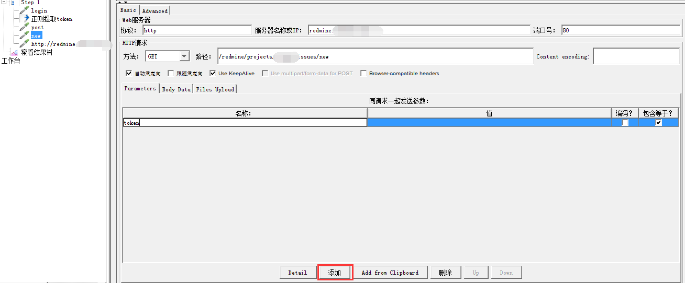
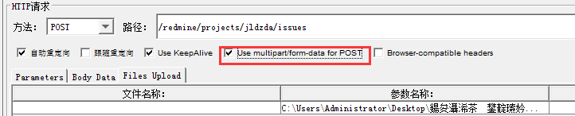

# JMeter 脚本录制实例及常用技巧

[本文链接](https://github.com/jlhxxxx/Test/blob/master/JMeter%20Example%20and%20FAQ.md)

## 完整录制redmine脚本全攻略

> 说明：本文实例部分内容基于JMeter3.3，JMeter更新部分内容可能会不一致，实践时应灵活处置

### 录制“登录”脚本

* badbody 录制没问题，脚本执行报错

    

    **分析及解决**

    * 登录时上传 5 个参数，其中 utf8 是字符编码, username 用户名, password 密码, login 登录按钮，应该都没有问题。就剩 authenticity_token ，google 一下，大概就是客户端和服务器之间身份验证的一种方式，那很明显问题出在这里。

    * 录制完脚本用 JMeter 打开，添加查看结果树（用于调试），先执行一下脚本，查看结果树。第二个报错的采样结果 post ，点开右侧【取样器结果】，有一行蓝字 “Response code: 422” 应该就是错误原因，不过看不懂；再看【请求】选项，找到 post date 内容

      

    * authenticity\_token 和我们写到参数上传的一样,再看【响应数据】

       

    * 没有找到 authenticity\_token ,不过有一个 csrf-token ，应该是一个东西，可是两个值不一样，猜想这个 token 是动态的，每切换一个页面都会有变化，所以要用正则表达式动态提取。怎么提取呢？猜想 token 应该是从上个页面传来的值，查看 login 结果

      

    * 【取样器结果】正常，【请求】没东西，【响应数据】有个 csrf-token ，哈哈，应该就是它了。现在就该用正则表达式提取器了。

    * 在第一个 login 页面后添加正则表达式提取器（后面才发现这个顺序没什么用，无非是看的直观一点，具体参考手册中执行顺序），怎么写正则表达式费了老大工夫，然后发现个小技巧：
        * 首先把包含要提取的代码的响应数据复制到注释栏里，比如要从
          `<meta name="csrf-token" content="RwLYI1gDFXim2GkaTc6+R/y8mBwpXecfqcphqWMYsKpRgn3vx94tBbjQZ6Hkp0zCUroEi/eGIJPWJIqk2fLoZg==" />`中提取出`RwLYI1gDFXim2GkaTc6+R/y8mBwpXecfqcphqWMYsKpRgn3vx94tBbjQZ6Hkp0zCUroEi/eGIJPWJIqk2fLoZg==`，我们在注释里填上`name="csrf-token" content="RwLYI1gDFXim2GkaTc6+R/y8mBwpXecfqcphqWMYsKpRgn3vx94tBbjQZ6Hkp0zCUroEi/eGIJPWJIqk2fLoZg==" />`，不用完整，只要包含要提取的数据就好，注意最好要带标识（一个好习惯，比如说：`name="csrf-token"`）,然后再复制到正则表达式里，把要提取的数据改成`（）`

          
        * 然后就可以参考手册在“（）”里添加规范的正则表达式，最后补全其他内容，写的不对的可以根据注释修改调整。**如果有多个匹配项,可以修改匹配数字来选择取第几个匹配项的值。**

          

    * 修改之后重新运行脚本，测试通过，没有报错，问题解决。

### 录制“新建问题”脚本

* badboy 录制传参乱码（_挂起_）

    

    **分析及解决**

    * 百度说修改 `ie=utf-8` 为 `ie=gkb` ，但是每次录制每个页面都要改，改起来没有意义，以后有更好的方法再说吧。

      
* 测试通过没有报错，但问题没有新建成功  

    **分析及解决**

    * 一步步来，首先将脚本中乱码找到对应的值改过来，这里为了先把脚本调通，我们先不参数化，直接传固定值（**注意不要多空格**）

      

      

    * 运行一下，没有报错，但是 redmine 上没有增加记录，查看结果树研究下，这里响应数据 txt 的看不懂，可以切换到 browser 直观一点，问题很明显了，没有登录上

      

    * 原因出现在哪一步呢，四个采样器结果查看都没有登录上，登录的之前应该是调通了，然后发现 new 采样器没有传 token 值，加上试试

      

    * 再次运行脚本，查看结果，发现采样器结果都登录上去了，但是还有问题，提示 bug 等级不包含于列表中，我之前提交的是“致命的”

      

      这里bug等级很明显是有“致命的”这个等级的，查看 html 源码，`value="致命的"`有这个值，问题应该不在这里，觉得可能是编码的问题，在采样器里 Content encoding 加上 `utf-8` ,再次运行脚本，新建成功，问题解决。

      

    * 后期用JMter4.0再次录制脚本的时候，按照上面设置仍出现登陆不上且页面为英文的问题，最后找了半天，发现是**编码**的问题：

      

      这里编码如果打勾的话，传递中文字符会变成下面这样，所以传中文字符的时候，注意**编码**不要打勾。

      

    * 然后发现不用 new 这个采样器也能新建成功的，又精简了脚本。

      

### 录制“修改问题”脚本

* 测试通过没有报错，但问题没有修改成功，显示被其他人抢先更新（_不完全解决_）  

    **分析与解决**

    * 首先还是录制脚本，删掉多余的，修改字符编码，可以将前面的登录采样器复制来直接用，测试脚本的时候出现了新的问题：

      

    * 页面应该没有问题，怀疑是传参的问题，对比下新增和修改的传参，多了四个参数，其中 “\_method” 应该是传参方法，可能有问题；“issue[notes]” 是问题描述，没有问题；“issue[lock\_version]” 是什么锁定信息，重点怀疑；last\_journal\_id 没有传值，应该没问题；

      
    * 在浏览器中打开修改界面，F12 查找 “lock_version”，发现 `value="1"` ,改成 “0” ，然后提交，复现错误，看来就是这个问题：

      

    * 将 “lock_version” 传参值改成 1 ，运行脚本，测试通过；

      

    * 但是，再次运行又出现同样错误，还是浏览器调试，发现“lock_version” `value="2"`，看来这个值是每修改一次加 1 。一开始考虑加个计数器，但是这里初值并不一定是 0 ，最后决定像 token 一样先读取再传递。

    * 然而，一开始怎么取都取不到 lock\_version 值，最后才发现是正则表达式里的“[ ]”没有转义（切记切记）：

      

    * 换个思路，把 lock\_version 删除，重新运行脚本，也能修改成功，看来 lock\_version 传值不是必须的，只是防止两个人同时修改一个问题的校验。但是又发现奇怪的问题。

      
* 打开 JMeter 第一次运行脚本，不报错，但查看结果树 browser 会变成英文界面，再次运行或多运行几次才会变成中文界面，问题才会新建或修改成功

     

    **分析与解决**

    * 手动建立脚本找到原因,将【自动重定向】改成【跟随重定向】解决问题（排除法）。

      
* **手动建立脚本和录制脚本的区别及注意事项**
    * 手动和录制的 Cookie Policy 不一样，不过目前没发现对测试有什么影响

      
    * 手动建立要将录制的 Http 信息头管理器拷过来，不然录制的脚本会报错且会变成英文的：

      
    * 手动建脚本通过添加 Http 请求默认值，可以省很多工夫：

      
    * 手动录制的脚本传参【编码？】未选中测试时可能会报 422 错，应选中：

      
### 录制“删除问题”脚本

* 感觉遇到了史诗级难题，JMeter 不支持弹出提示框：

      

    **分析与解决**

    * 不管 3721，录完脚本发现删除问题只传了两个参数，修改关联脚本后运行测试，报错: 422 ，这个错误好熟悉；

      
    * 之前是因为没有传 token ，这里很明显传了，怀疑是因为删除问题之前必须要在问题详情界面，只有从问题详情界面传的 token 值才会正确，而新建和修改问题都可以省去进入详情界面，增加进入详情界面采样器试试：

      
    * 问题解决，看来不支持提示框也不影响。然后发现一个有趣的小 bug ，进入其他问题的详情界面也可以删除问题。

      

### 参数化:删除多个问题

* 没有遇到明显的问题
    * 首先新建5个问题,新建问题循环 5 次即可，注意把登录操作放进仅一次控制器里：

      
    * 新建 excel ，输入要删除的 issue ，另存为 csv 格式：

      
    * 添加 CSV Date Set Config ，后面直接引用 `${del_issue}` 即可：

      
    * 完美运行：

      

### 录制“上传图片”脚本

*   
    **分析与解决**  
    * 录制新建问题脚本，这次加上上传图片，发现多了几个参数，我们重点调整的地方在 Files Upload ：

      
      
    * 具体百度，回到 Badboy 找到上传文件的参数：

      
    * 第一个 `Content-Disposition: form-data` 意思是我们要选中 “use multipart...” 选项:

      
    * 第二个 `name="attachments[1][file]"` 就是我们在“参数名称”里要填的，最后的 `Content-Type: image/png` 就是“ MIME 类型”：

      

      运行脚本，测试通过。
    * 修改图片同理，增加 n 张图片参数名称也会增加：attachments[n][file]；删除图片同删除问题类似，在 `/redmine/attachments/${img_issue}`页面传参: `_method=delete`。

## 提取 json 数据

* 有些 method 不写在路径里会报错（_原因暂时未分析_）

    
    

    * 修改后测试通过

      
      

* JMeter 读取 json 数据
    * 这里有篇文章可以看下 [Jmeter BeanShell PostProcessor 提取 json 数据](http://blog.csdn.net/qq_33903854/article/details/53589515)，学习下怎么写提取 json 的 Script 

        ```java
        举例：提取 json 数据中所有 name 字段值
        返回的 json 格式如下： 
        {“body”:{“apps”:[{“name”:”111”},{“name”:”222”}]}}

        代码如下：
        import org.json.*;

        String response_data = prev.getResponseDataAsString();
        JSONObject data_obj = new JSONObject(response_data);
        String apps_str = data_obj.get("body").get("apps").toString();
        JSONArray apps_array = new JSONArray(apps_str);
        String[] result = new String[apps_array.length()];
        for(int i=0;i<apps_array.length();i++){
            JSONObject app_obj = new JSONObject(apps_array.get(i).toString());
            String name = app_obj.get("name").toString();
            result[i] = name;
        }
        vars.put("result", Arrays.toString(result));
        ```
    * 如果测试失败怀疑自己写的 Script 有问题，可以通过日志检查一下错误信息；也可以想办法验证一下提取的结果是否正确，新增一个随便 http 请求，加上要验证的数据作为参数，然后运行测试，查看结果树中的请求值：

      
      
    * 我在测试的时候碰到两个问题，一个是缺少 json-20170516.jar 包，测试时日志可以查看报错，导入之后问题解决；

      
    * 还有一个问题是取不到 array.length 的值，改成 array.length() 最后通过（带不带括号测试好几遍都不行，最后诡异的通过了，怀疑是之前哪里用了中文标点，现在也无从验证）。

      

* sybx 压力测试分析

    * 可以以 plxcb--plcbnyxg（plcbsfxg）--pltb 流程建立线程组（数据经过一个循环可以重复测试，这样稳定性测试就可简单通过增加循环次数来搞定）

## 参数化路径思路

* CSV Date Set Config 支持相对路径，但是 file upload 不支持，这样每次拷贝测试脚本到不同计算机都要修改路径，对于我这样的懒人来说是很麻烦的。  

    **思考与解决**

    * 第一种思路：使用批处理命令查找 jmx 脚本中目录名称并改成当前目录，看起来可实现度挺高的，但是 1 命令不好写，2 对于目录中有中文字符不好处理，3 有时候会出现乱码，其实根本原因是不会(_挂起_)。
    * 第二种思路：添加目录值为自定义变量，修改时只要修改变量值即可，大大减少工作量，而且对于修改范围灵活性高，所以最后采用此方法。

      
      

## JDBC 连接 oracle 详解

参考文章：[jmeter 性能测试 JDBC Request （查询数据库获取数据库数据） 的使用](http://www.cnblogs.com/0201zcr/p/5280090.html) 

### 主要流程

* 安装jdbc驱动
  * JDK 1.6以上下载`ojdbc6.jar`[官网下载](http://www.oracle.com/technetwork/cn/articles/oem/jdbc-112010-094555-zhs.html) ，也可以到 PLSQL--instantclient_11_2 中找，然后放到 JMeter--lib 文件夹中


* 添加--配置元件--JDBC Connection Configuration

  

  * **Variable name**：保存sql语句返回结果的变量名

  * **Max Number of Connections**：默认就好

  * **Max Wait**：连接超时可以修改此时间

  * **Auto Commit**：可配合`JDBC request`中特定的`Query Type`设置

  * **Validation Query**：`Select 1 from dual`

    > 这里一开始填`Select 1`，后面运行时会报错：`Cannot create PoolableConnectionFactory (ORA-00923: FROM keyword not found where expected)`

  * **Database URL**：`jdbc:oracle:thin:@{host_IP_or_machine_name}:{Oracle 监听器监听的端口}:{你的Oracle实例的名字}`

    > oracle只允许一个request执行一条sql语句；
    >
    > （未验证）mysql后面加上`?allowMultiQueries=true`可以允许一个request执行多条sql语句；
    >
    > [Oracle与mysql官方jdbc的一些区别](https://blog.csdn.net/mikyz/article/details/69398207?locationNum=2&fps=1)

  * **JDBC Driver class**：`oracle.jdbc.driver.OracleDriver`

  * **Username**：`访问上面Oracle实例的用户名`

  * **Password**：`对应的密码`

    | **Datebase**  | **Driver class**                                             | **Database URL**                                             |
    | ------------- | ------------------------------------------------------------ | ------------------------------------------------------------ |
    | MySQL         | com.mysql.jdbc.Driver                                        | jdbc:mysql://host:port/{dbname}                              |
    | PostgreSQL    | org.postgresql.Driver                                        | jdbc:postgresql:{dbname}                                     |
    | Oracle        | oracle.jdbc.driver.OracleDriver                              | jdbc:oracle:thin:user/pass@//host:port/service               |
    | Ingres (2006) | ingres.jdbc.IngresDriver                                     | jdbc:ingres://host:port/db[;attr=value]                      |
    | MSSQL         | com.microsoft.sqlserver.jdbc.SQLServerDriver或者net.sourceforge.jtds.jdbc.Driver | jdbc:sqlserver://IP:1433;databaseName=DBname或者jdbc:jtds:sqlserver://localhost:1433/"+"library" |

* 添加--Sampler--JDBC request

  

  * **Variable Name**：`同JDBC Connection Configuration中设置的连接池名称一致`

    > **容易漏填**，不填会报错：`Variable Name must not be null in JDBC Request`

  * **Query Type**：SQL的类型，查询选择 **Select Statement**；查询SQL需 **传递参数** 选择**Prepared Select Statement**

    > [JDBC Request之Query Type](http://www.cnblogs.com/imyalost/p/6498029.html)

  * **Query**：输入对应SQL，单条SQL语句后不能加分号`;`

  * **Parameter valus**：参数值

  * **Parameter types**：参数类型，可参考[Javadoc for java.sql.Types](https://docs.oracle.com/javase/6/docs/api/java/sql/Types.html)，多个变量使用`，` 分隔。

    > （未验证）这里假如你有数据是`int`类型的，也要在Parameter types 那里标示为`varchar`类型，否则无法运行。

  * **Variable names**：保存sql语句返回结果的变量名

  * **Result variable name**：创建一个对象变量，保存所有返回的结果

  * **Query timeout**：查询超时时间

  * **Handle result set**：定义如何处理由callable statements语句返回的结果

### JDBC Request 参数化

* 可以在**Query** 或 **Parameter valus** 中使用`${变量名}`的方式引用
* 也可以在**Query** 中使用`?`作为占位符，并在**Parameter valus**和**Parameter types**中传递参数值和参数类型

### 提取响应数据

* 使用**Variables names** 方法

  * 如果给这个参数设置了值，它会保存sql语句返回的数据和返回数据的总行数。例如，sql语句返回2行3列，且variables names设置为`aab001,,aab003`，那么如下变量会被设置为：

    ```sql
    aab001_#=2 (总行数)
    aab001_1=第1列, 第1行
    aab001_2=第1列, 第2行 
    aab003_#=2 (总行数) 
    aab003_1=第3列, 第1行
    aab003_2=第3列, 第2行
    ```

  * 如果返回结果为`0`，那么`aab001_#`和`aab003_#`会被设置为`0`，其它变量不会设置值。

  * 如果第一次返回6行数据，第二次只返回3行数据，那么第一次那多的3行数据变量会被清除。

  * 可以使用`${aab001_#}`、`${aab001_1}`...来调用相应的值

* 使用**Result variable name**方法

  * 如果给这个参数设置值，它会创建一个对象变量，保存所有返回的结果，获取具体值的方法：`columnValue = vars.getObject("resultObject").get(0).get("Column Name")`，下例设置变量名称为`res`

    

  * 添加**BeanShell Sampler**，在**Scrip**中输入：

    ```javascript
    aac001 = vars.getObject("res").get(0).get("AAC001");
    ```

    即可获得响应数据为第一行AAC001的值即`110101198801010078`，可以再用正则提取器再去提取；也可以在**Scrip**中输入：

    ```javascript
    String aac001 = vars.getObject("res").get(0).get("AAC001");
    vars.put("aac001",aac001);
    ```

    即将`110101198801010078`存入名为`aac001`变量中，可以通过`${aac001}`直接调用。注意这时响应数据为空。

* 还可以使用CONCAT函数方便使用正则表达式提取响应数据，如：

  ```sql
  SELECT CONCAT('"NAME":',NAME) FROM TABLE_A;--正则表达式为："NAME":(.*)
  SELECT CONCAT('NUM=',NUM) FROM TABLE_B;--正则表达式为：NUM=(.*)
  ```

  注意这里如果同时设置**Result variable name**其返回值会不一样：

  ​

### 执行存储过程

* 执行带参数存储过程

  * 参考：[Oracle存储过程写法小例子](http://www.cnblogs.com/Zeros/p/8081080.html)

  * 首先查看存储过程，执行时`in`的参数是我们需要传入的

    

  * 新建**JDBC Request**，`in`参数可以在declare后声明并赋值，然后将名称带入存储过程（如`PI_CAE026`）;也可以不声明直接带入存储过程;`out`参数是一定要声明的

    

###  oracle曲线执行多条sql语句

* 正常来说是不行的，不过可以利用执行存储过程的方式执行多条sql

  

  其中**Query Type**一定要选择**Callable Statement**，`select`语句一定要带`into`且`select`结果只能是单值，不支持声明`%rowtype`格式的，其他修改语句就好说了；没有`select`语句也不需要`declare`声明部分，但`begin`和`end`一定要。

## 响应结果 unicode 转成中文显示

* 修改Jmeter根目录下的jmeter.properties文件，把编码格式改为utf-8

  ```properties
  sampleresult.default.encoding=UTF-8
  ```

* 添加后置处理器 BeanShell PostProcessor，并加入代码

  ```javascript
  String s=new String(prev.getResponseData(),"UTF-8");
  char aChar;
  int len= s.length();
  StringBuffer outBuffer=new StringBuffer(len);
  for(int x =0; x <len;){
      aChar= s.charAt(x++);
      if(aChar=='\\'){
          aChar= s.charAt(x++);
          if(aChar=='u'){
              int value =0;
              for(int i=0;i<4;i++){
                  aChar= s.charAt(x++);
                  switch(aChar){
                      case'0':
                      case'1':
                      case'2':
                      case'3':
                      case'4':
                      case'5':
                      case'6':
                      case'7':
                      case'8':
                      case'9':
                          value=(value <<4)+aChar-'0';
                          break;
                      case'a':
                      case'b':
                      case'c':
                      case'd':
                      case'e':
                      case'f':
                          value=(value <<4)+10+aChar-'a';
                          break;
                      case'A':
                      case'B':
                      case'C':
                      case'D':
                      case'E':
                      case'F':
                          value=(value <<4)+10+aChar-'A';
                          break;
                      default:
                          throw new IllegalArgumentException(
                                  "Malformed   \\uxxxx  encoding.");}}
              outBuffer.append((char) value);}else{
              if(aChar=='t')
                  aChar='\t';
              else if(aChar=='r')
              aChar='\r';
              else if(aChar=='n')
              aChar='\n';
              else if(aChar=='f')
              aChar='\f';
              outBuffer.append(aChar);}}else
          outBuffer.append(aChar);}
  prev.setResponseData(outBuffer.toString());
  ```

  > **在进行正式压力测试时，要记得把 BeanShell PostProcessor 禁用掉，否则影响测试结果**