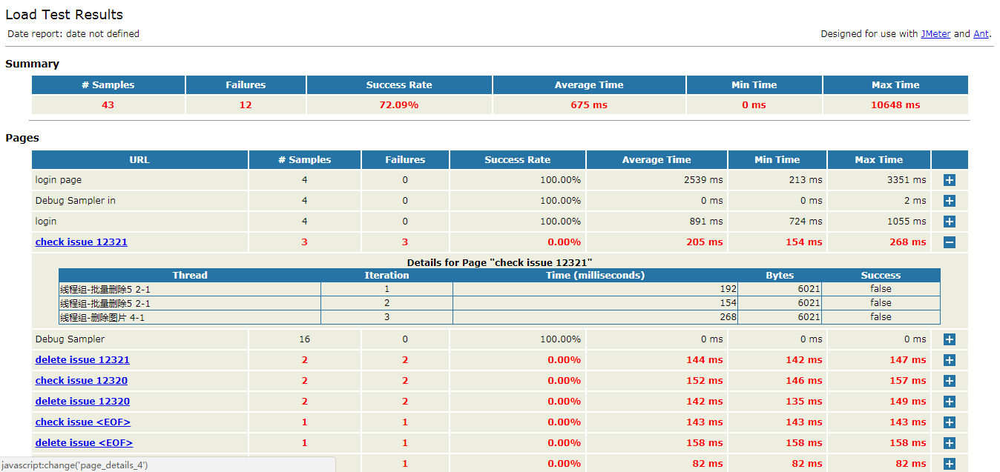

# JMeter

[本文链接](https://github.com/jlhxxxx/Test/blob/master/JMeter.md) [测试笔记](https://github.com/jlhxxxx/Test/blob/master/JMeter%20Example%20and%20FAQ.md)

## 一、操作手册解读 [User's Manual](http://jmeter.apache.org/usermanual/index.html)

* 基础：1、2、3、4、5；
* 特定实例：6、7、8；
* test plan：9、10、11；
* **测试原件：监听器12、组件18、属性19；**
* **进阶：函数20，正则表达式21，远程测试13，最佳实践16，小技巧22；**

## 二、JMeter性能测试流程

### 2.1 分析确定性能指标
1. 确定性能测试的并发虚拟用户数

        线程数：测试环境平均并发数=（高峰段用户数*10%）/n
    * n 为生产环境和测试环境服务器配置折算比  
        n=公倍数（（生产web服务器数/测试web服务器数），（生产app服务器数/测试app服务器数））*（生产服务器内存/测试服务器内存）
    * 10% 为假定所有用户中只有10%在同一时刻做同一件事

2. 确定性能测试持续时长

    * 找到操作集中时间
1. 确定性能测试的存量数据
4. 确定测试人员重点观察的性能指标

    * 平均响应时长、90%阈值、吞吐率、错误率

### 2.2 录制脚本(重点关联及参数化)
**循环：录制-调试-修改（参数化、关联）**
* JMeter执行顺序

  
 

* 使用Badboy：[Jmeter脚本录制方法（一）——分别使用Badboy录制和Jmeter自带的代理服务器录制](http://www.cnblogs.com/hong-fithing/p/7645145.html)

* 使用自带的代理服务器录制：同上

* 手工编写脚本：[Jmeter脚本录制方法（二）——手工编写脚本（jmeter与fiddler结合使用）](http://www.cnblogs.com/hong-fithing/p/7668258.html)

* 正则表达式：[Jmeter脚本调试——关联（正则表达式）](http://www.cnblogs.com/hong-fithing/p/7650762.html#3807619)

  
 

### 2.3 运行脚本
* 压力由小到大：GUI-非GUI-远程
* Ant：批量测试和报表生成（第三章）

### 2.4 分析测试结果上报缺陷
* 结合日志文件
* 巧用监听器，识别缺陷
    1. 尽量不要使用 GUI 模式进行性能测试
    1. 善于观察图形结果，直观分析问题
        * 正常情况下，平均响应时长是平滑的，大致平行于下边界
        * 采样响应时长标准差正常情况分布均匀
        * 增加并发线程数或减少脚本延迟，找到最大吞吐率
    1. 查看结果树：用于调试脚本
    1. 条样视图：实时观察系统响应时长变化
    1. 聚合报告：综合判断系统性能是否满足要求：注意平均响应时长、90%阈值、吞吐率、错误率
    1. 表格查看结果：逐条分析性能测试数据，用于异常分析
    1. 监视器结果
    1. 分布图形：观察分布规律，寻找隐藏缺陷
    1. 聚合图形：寻找加载最慢的页面，可用yslow工具

* 性能测试报告内容

    

## 三、基于 Ant 的 JMeter 性能自动化测试初探
* 参考文章：[基于 Ant 的 JMeter 性能自动化测试](http://blog.csdn.net/wetest_tencent/article/details/51154419)
* 简要流程就是安装好 ant 后，拷贝 ant-JMeter-1.1.1.jar ，建立对应目录并填写 build.xml 配置文件，在 build.xml 目录下执行 ant 命令即可。最后生成的 html 看起来逼格很高。

* 因为之前的 redmine 脚本批量建的问题都已经删除了，所以这里有报错。 Ant 自动化测试的好处就是可以批量运行多个脚本,省去了一个个运行繁琐的步骤。但是前提就是**一定要写好脚本，并调试通过**。
