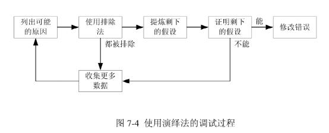

#《软件测试的艺术》梅尔斯版

​                  

## 一 、软件测试的心理学和经济学

1. 软件测试的心理学

   “测试是为发现错误而执行程序的过程”。

2. 软件测试的经济学

   1. 黑盒测试

      穷举输入测试无法实现

   2. 白盒测试

      穷举路径测试无法实现

3. **软件测试的原则**

   * 测试用例中一个必需部分是对预期输出或结果进行定义；
   * 程序员应避免测试自己编写的程序；（调试相反）
   * 编写软件的组织不应当测试自已编写的软件；
   * 应当彻底检查每个测试的执行结果；
   * 测试用例的编写不仅应当根据有效和预料到的输入情况，而且也应当根据无效和未预料到的输入情况；
   * 检查程序是否“未做其应该做的”仅是测试的一半，测试的另一半是检查程是否“做了其不应该做的”；
   * 应避免测试用例用后即弃，除非软件本身就是个一次性的软件；
   * 计划测试工作时不应默许假定不会发现错误；
   * 程序某部分存在更多错误的可能性，与该部分已发现错误的数量成正比；
   * 软件测试是一项极富创造性，极具智力的挑战性的工作。

## 二、代码检查、走查与评审

1. 用于代码检查的错误列表
   1. 数据引用错误
      * 是否有引用的变量未赋值或未初始化？
      * 对于所有的数组引用，是否每一个下标的值都在相应维规定的界限之内？
      * 对于所有的数组引用，是否每一个下标的值都是整数？
      * 对于所有的通过指针或引用变量的引用，当前引用的内存单元是否分配？
      * 如果一个内存区域具有不同属性的别名，当通过别名进行引用时，内存区域中的数据值是否具有正确的属性？
      * 变量值的类型或属性是否与编译器所预期的一致？
      * 在使用的计算机上，当内存分配的单元小于内存可寻址的单元大小时，是否存在直接或间接的寻址错误？
      * 当使用指针或引用变量时，被引用的内存的属性是否与编译所预期的一致？
      * 假如一个数据结构在多个过程或子程序中被引用，那么每个过程或子程序对该结构的定义是否都相同？
      * 如果字符串有索引，当对数组进行索引操作或下标引用，字符串的边界取值是否有“仅差一个(off-by-one)”的错误？
      * 对于面向对象的语言，是否所有的继承需求都在实现类中得到了满足？
   2. 数据声明错误
      * 是否所有的变量都进行了明确的声明？
      * 如果变量所有的属性在声明中没有明确说明，那么默认的属性能否被正确理解？
      * 如果变量在声明语句中被初始化，那么它的初始化是否正确？
      * 是否每个变量都被赋予了正确的长度和数据类型？
      * 变量的初始化是否与其存储空间的类型一致？
      * 是否存在着相似名称的变量（如 VOLT 和 VOLTS）？
   3. 运算错误
      * 是否存在不一致的数据类型（如非算术类型）的变量间的运算？
      * 是否有混合模式的运算？
      * 是否有相同数据类型不同字长变量间的运算？
      * 赋值语句的目标变量的数据类型是否小于右边表达式的数据类型或结果？
      * 在表达式的运算中是否存在表达式向上或向下溢出的情况？
      * 除法运算中的除数是否可能为 0？
      * 如果计算机表达变量的基本方式是基于二进制的，那么运算结果是否不精确？
      * 在特定场合，变量的值是否超出了有意义的范围？
      * 对于包含一个以上操作符的表达式，赋值顺序和操作符的优先顺序是否正确？
      * 整数的运算是否有使用不当的情况，尤其是除法？
   4. 比较错误
      * 是否有不同数据类型的变量之间的比较运算？
      * 是否有混合模式的比较运算？
      * 比较运算符是否正确？
      * 每个布尔表达式所叙述的内容是否都正确？
      * 布尔运算符的操作数是否是布尔类型的？
      * 在二进制的计算机上，是否有用二进制表示的小数或浮点数的比较运算？
      * 对于那些包含一个以上布尔运算符的表达式，赋值顺序以及运算符的优先顺序是否正确？
      * 编译器计算布尔表达式的方式是否会对程序产生影响？
   5. 控制流程错误
      * 如果程序包含多条分支路径，比如有计算 GOTO 语句，索引变量的值是否会大于可能的分支数量？
      * 是否所有的循环最终都终止了？
      * 程序、模块或子程序是否最终都终止了？
      * 由于实际情况没有满足循环的入口条件，循环体是否有可能从未执行过？
      * 如果循环同时由迭代变量和一个布尔条件所控制（如一个搜索循环），如果循环越界（fall-through）了，后果会如何？
      * 是否存在“仅差一个”的错误？
      * 如果编程语言中有语句组或代码块的概念（例如do-while或{……}），是否每一组语句都有一个明确的while语句，并且do语句也与其相应的语句组对应？
      * 是否存在不能穷尽的判断？举例来说，如果一个输入参数的预期值是1，2或3，当参数值不为l或2时，在逻辑上是否假设了参数必定为3？
   6. 接口错误
      * 被调用模块接收到的形参（parameter）数量是否等于调用模块发送的实参（argument）数量？另外，顺序是否正确？
      * 实参的属性是否与相应形参的属性相匹配？
      * 实参的量纲（单位）是否与对应形参的量纲相匹配？
      * 此模块传递给彼模块的实参数量、属性、量纲，是否与彼模块相应形参的数量、属性、量纲相匹配？
      * 如果调用了内置函数，实参的数量，属性，顺序是否正确？
      * 如果某个模块或类有多个入口点，是否引用了与当前入口点无关的形参？
      * 是否有子程序改变了某个原本仅为输入值的形参？
      * 如果存在全局变量．在所有引用它们的模块中，它们的定义和属性是否相同？
      * 常数是否以实参形式传递过？
   7. 输入/输出错误
      * 如果对文件明确声明过，其属性是否正确？
      * 打开文件的语句中各项属性的设置是否正确？
      * 格式规范是否与I/O语句中的信息相吻合？
      * 是否有足够的可用内存空间，来保留程序将读取的文件？
      * 是否所有的文件在使用之前都打开？
      * 是否所有的文件在使用之后都关闭了？
      * 是否判断文件结束的条件，并正确处理？
      * 对I/O出错情况处理是否正确？
      * 任何打印或显示的文本信息中是否存在拼写或语法错误？
   8. 其他检查
      * 在交叉引用列表中是否存在未引用过的变量？
      * 属性列表是否与预期的相一致？
      * 是否存在“警告”或“提示”信息？
      * 是否对输入的合法性进行了检查？
      * 是否遗漏了某个功能？
2. 人工测试方法
   * 利用错误列表进行代码检查。
   * 小组代码走查。
   * 桌面检查。
   * 同行评审。

## 三、测试用例的设计

**我们推荐的步骤是先使用黑盒测试方法来设计测试用例，然后视情况需要使用白盒测试方法来设计补充的测试用例。**

1. 白盒测试(White-Box Testing)

   1. 逻辑覆盖测试(Logic-Coverage Testing)

      白盒测试关注的是测试用例执行的程度或覆盖程序逻辑结构（源代码）的程度。完全的白盒测试是将程序中每条路径都执行到 （路径覆盖），然而对一个带有循环的程序来说，完全的路径测试并不一定切合实际。

      

      * **语句覆盖 SC**（Statement Coverage），就是设计若干个测试用例，运行被测程序，使得程序中每一可执行语句至少执行一次。这里的“若干个”，意味着使用测试用例越少越好。语句覆盖在测试中主要发现缺陷或错误语句。如例子中选择path ace即可覆盖所有可执行语句。

        **语句覆盖率的公式**：语句覆盖率=被评价到的语句数量/可执行的语句总数 x 100%；

        **语句覆盖的缺点**：对程序执行逻辑的覆盖很低。

      * **判定覆盖 DC**（Decision coverage），有时也称分支覆盖，就是指设计若干测试用例，运行被测程序，使得每个判定的取真分支和取假分支至少评价一次。如例子中选择path ace,path abd,path abe ,path acd 就是符合判定覆盖要求的路径。

        **判定覆盖的公式**：判定覆盖率=被评价到的判定分支个数/判定分支的总数X100%；

        **判定路径覆盖率**（DDP）=被评价到的判定路径数量/判定路径的总数X100%；

        **判定覆盖的缺点**：判定覆盖虽然把程序所有分支均覆盖到了，但其主要对整个表达式最终取值进行度量，忽略了表达式内部取值。

      * **条件覆盖 CC**（Condition Coverage），设计足够多的测试用例，运行被测程序，使得每一判定语句中每个逻辑条件的可能取值至少满足一次。例子中有两个判定语句，根据条件覆盖的定义，则应考虑“(A>1 and B==0)”和“(A==2 or X>1)”两个表达式中的变量取值，可以取两组值（A=2,B=1,X=2），（A=1,B=0,X=1）。

        **条件覆盖率的公式**：条件覆盖率=被评价到的条件取值的数量/条件取值的总数X100%；

        **条件覆盖的缺点**：只考虑到每个判定语句中的每个表达式，没有考虑到各个条件分支（或者涉及不到全部分支），即不能够满足判定覆盖。

      * **判定条件覆盖 CDC**（Condition/ Decision Coverage），设计足够多的测试用例，使得判定中的每个条件的所有可能（真/假）至少出现一次，且每个判定本身的判定结果也至少出现一次。例子中不仅要考虑path ace,path abd,path abe,path acd 四条分支路径（判定覆盖），也要考虑“(A>1 and B==0)”和“(A==2 or X>1)”两个条件中的每个表达式的取值（条件覆盖）。

        **判定条件覆盖率的公式**：条件判定覆盖率=被评价到的条件取值和判定分支的数量/（条件取值总数+判定分支总数）；

        **判定条件覆盖的缺点**：没有考虑单个判定对整体结果的影响，无法发现逻辑错误。

      * **修正判定条件覆盖** ，修正判定条件覆盖单元的入口与出口必须至少被调用一次，程序中判断的每一个分支必须至少被执行一次。对于程序中通过逻辑运算(AND，OR等)组成判断的基本布尔条件，每个条件必须取遍所有可能的值且每一个条件对判断的结果具有独立的作用。

      * **多重条件覆盖 MCC**（Multiple Condition Coverage），也称条件组合覆盖，就是设计足够多的测试用例，使得每个判定中条件的各种可能组合都至少出现一次（以数轴形式划分区域，提取交集，建立最少的测试用例）。这种方法包含了“分支覆盖”和“条件覆盖”的各种要求。满足条件组合覆盖一定满足判定覆盖、条件覆盖、判定条件覆盖。例子中A==2 or X>1处，所有可能的条件组合为：“A== 2，X>1”、“A==2,X<=1”和“A!=2,X>1”三种。在条件覆盖中仅需考虑到这三种的一种即可，而在条件组合覆盖中需要都考虑到。

        **条件组合覆盖率的公式**：条件组合覆盖率=被评价到的条件取值组合的数量/条件取值组合的总数；

        **条件组合覆盖的缺点**：判定语句较多时，条件组合值比较多。

      * **路径覆盖**，设计足够多的测试用例，执行程序所有可能的路径。

        **路径覆盖率的公式**：路径覆盖率=被执行到的路径数/程序中总的路径数；

        **优点**：路径覆盖是覆盖率最高的一种覆盖技术。

        **路径覆盖测试步骤**：

        * 将程序流程图转换成控制流图；
        * 经过语法分析求的路径表达式；
        * 生成路径图；
        * 进行路径编码；
        * 经过译码得到执行的路径；
        * 通过路径枚举产生特定路径测试用例；
        * 修正的条件判断覆盖率(MC/DC)。

   2. 等价划分(Equivalence Partitioning)

      将程序输入范围进行划分，将其划分为有限数量的等价类，然后从每个部分中选取少数代表性数据作为测试用例，这样就可以合理地假设测试每个等价类的代表性数据等同于测试该类的其他任何数据。使用等价划分方法设计测试用例主要有两个步骤：

      1. 划分等价类

         在输入条件规定了取值范围或值的个数的情况下，则可以确立一个有效等价类和两个无效等价类；

         在输入条件规定了输入值的集合或者规定了“必须如何”的条件的情况下，可确立一个有效等价类和一个无效等价类；

         在输入条件是一个布尔量的情况下，可确定一个有效等价类和一个无效等价类；

         在规定了输入数据的一组值（假定n个），并且程序要对每一个输入值分别处理的情况下，可确立n个有效等价类和一个无效等价类；

         在规定了输入数据必须遵守的规则的情况下，可确立一个有效等价类（符合规则）和若干个无效等价类（从不同角度违反规则）；

         在确知已划分的等价类中各元素在程序处理中的方式不同的情况下，则应再将该等价类进一步的划分为更小的等价类。

      2. 生成测试用例

         为每个等价类设置一个不同的编号；

         编写新的测试用例，尽可能多地覆盖那些尚未被涵盖的有效等价类，直到所有的有效等价类都被测试用例所覆盖（包含进去）；

         编写新的用例，覆盖一个且仅一个尚未被覆盖的无效等价类，直到所有的无效等价类都被测试用例所覆盖。

   3. 边界值分析(Boundary-Value Analysis)

      边界条件，是指输入和输出等价类中那些恰好处于边界、或超过边界、或在边界以下的状态。边界值分析方法与等价划分方法存在两方面的不同：

      1. 与从等价类中挑选出任意一个元素作为代表不同，边界值分析需要选择一个或多个元素，以便等价类的每个边界都经过一次测试。
      2. 与仅仅关注输入条件（输入空间）不同，还需要考虑从结果空间（输出等价类）设计测试用例。

      **基于边界值分析方法选择测试用例的原则**：

      * 如果输入条件规定了一个输入值范围，那么应针对范围的边界设计测试用例，针对刚刚越界的情况设计无效输入测试用例；
      * 如果输入条件规定了输入值的数量，那么应针对最小数量输入值、最大数量输入值，以及比最小数量少一个、比最大数量多一个的情况设计测试用例；
      * 将前两个规则应用于输出条件，即设计测试用例使输出值达到边界值及其左右的值；
      * 如果程序的规格说明给出的输入域或输出域是有序集合，则应选取集合的第一个元素和最后一个元素作为测试用例；
      * 如果程序中使用了一个内部数据结构，则应当选择这个内部数据结构的边界上的值作为测试用例；
      * 分析规格说明，找出其它可能的边界条件。

   4. 因果图(Cause-Effect Graphing)

      边界值分析和等价划分的一个弱点是未对输入条件的组合进行分析。因果图有助于用一个系统的方法选择出高效的测试用例集。它还有一个额外的好处，就是可以指出规格说明的不完整性和不明确之处。

      生成测试用例时采用的过程如下：

      1. 将规格说明分解为可执行的片段；
      2. 确定规格说明中的因果关系。所谓“因”，是指一个明确的输入条件或输入条件的等价类。所谓“果”，是指一个输出条件或系统转换（输入对程序或系统状态的延续影响）；
      3. 分析规格说明的语义内容，并将其转换为连接因果关系的布尔图。这就是所谓的因果图；
      4. 给图加上注解符号，说明由于语法或环境的限制而不能联系起来的“因”和“果”；
      5. 通过仔细地跟踪图中的状态变化情况，将因果图转换成一个有限项的判定表。表中的每一列代表一个测试用例；
      6. 将判定表中的列转换成测试用例。

      

      

      *约束E表示a和b不能同时为1。约束I表示a、b、c不能同时为0。约束O表示a、b中有且仅有一个必须为1,约束R表示如果a为1，b也必须为1。*

      

      *在结果之间通常需要建立约束关系。图中的约束M表示，如果结果a为0,则b强制为0。*

2. 错误猜测(Error Guessing)

   基本思想是列举出可能犯的错误或错误易发情况的清单，然后依据清单来编写测试用例。

3. 测试策略

   1. 如果规格说明中包含输入条件组合的情况，应首先使用因果图分析方法。
   2. 在任何情况下都应使用边界值分析方法。应记住，这是对输入和输出边界进行的分析。边界值分析可以产生一系列补充的测试条件，但是，也正如“因果图分析”一节所述，多数甚至全部条件都可以被整合到因果图分析中。
   3. 应为输入和输出确定有效和无效等价类，在必要情况下对上面确认的测试用例进行补充。
   4. 使用错误猜测技术增加更多的测试用例。
   5. 针对上述测试用例集检查程序的逻辑结构。应使用判定覆盖、条件覆盖、判定/条件覆盖或多重条件覆盖准则（最后的一个最为完整）。如果覆盖准则未能被前四个步骤中确定的测试用例所满足，并且满足准则也并非不可能（由于程序的性质限制，某些条件的组合也许是不可能实现的），那么增加足够数量的测试用例，以使覆盖准则得到满足。

## 四、模块（单元）测试

模块测试（或单元测试）是对程序中的单个子程序、子程序或过程进行测试的过程。这样做的动机有三个。首先，由于模块测试的注意力一开始集中在程序的较小单元上，因此它是一种管理组合的测试元素的手段。其次，模块测试减轻了调试（准确定位并纠正某个已知错误的过程）的难度，这是因为一旦某个错误被发现出来，我们就知道它在哪个具体的模块中。第三，模块测试通过为我们提供同时测试多个模块的可能，将并行工程引入软件测试中。模块测试的目的是将模块的功能与定义模块的功能规格说明或接口规格说明进行比较。

1. 测试用例设计

   使用一种或多种白盒测试方法分析模块的逻辑结构，然后使用黑盒测试方法对照模块的规格说明以补充测试用例。

   （例子看不懂，跳过）

2. 增量测试

   软件测试是否应先独立地测试每个模块，然后再将这些模块组装成完整的程序？还是先将下一步要测试的模块组装到测试完成的模块集合中，然后再进行测试？第一种方法称为非增量测试或“崩溃（big-bang ) ”测试，而第二种方法称为增量测试或集成。

   * 非增量测试所需的工作量要多一些。
   * 如果使用了增量测试，可以较早地发现模块中与不匹配接口、不正确假设相关的编程错误。
   * 因此如果使用了增量测试，调试会进行得容易一些。
   * 增量测试会将测试进行得更彻底。
   * 非增量测试所占用的机器时间显得少一些。
   * 模块测试阶段开始时，如果使用的是非增量测试，就会有更多的机会进行并行操作（也就是说，所有的模块可以同时测试 ）。对于大型的软件项目〔模块和人员都很多），这可能十分重要，因为在模块测试开始之时，项目的人员数量常常处于最高峰。

3. 自顶向下测试与自底向上测试（增量测试）

   1. 自顶向下的测试

      编写桩模块是很关键的。

      * 如果程序中存在关键部分（例如模块G），那么在设计模块序列时就应将这些关键模块尽可能早地添加进去。所谓“关键部分”可能是某个复杂的模块、某个采用新算法的模块或某个被怀疑容易发生错误的模块。
      * 在设计模块序列时，应将 I/O 模块尽可能早地添加进来。

   2. 自底向上的测试

      驱动模块可以交迭地调用被测模块，因此不需要为驱动模块提供多个版本。

   3. 比较

      

## 五、更高级别的测试

当程序无法实现其最终用户要求的合理功能时，就发生了一个软件错误。

软件开发过程在很大程度上是沟通有关最终程序的信息、并将信息从一种形式转换到另一种形式。由于这个原因，绝大部分软件错误都可以归因为信息沟通和转换时发生的故障、差错和干扰。

   

1. 功能测试(Function Testing)

   功能测试是一个试图发现程序与其外部规格说明之间存在不一致的过程。外部规格说明是一份从最终用户的角度对程序行为的精确描述。除了在小程序中的使用情况之外，功能测试通常是一项黑盒操作,要依赖早期的模块测试的过程来实现理想的白盒逻辑覆盖准则。在进行功能测试时，需要对规格说明进行分析以获取测试用例集。等价类划分方法、边界值分析方法、因果图分析方法和错误猜测方法尤其适合于功能测试。

2. 系统测试(System Testing)

   系统测试并非是测试整个系统或程序功能的过程，因为有了功能测试，这样会显得多余。系统测试有着特定的目的：将系统或程序与其初始目标进行比较。给定这个目标之后，隐含两方面的含义：1.系统测试并不局限于系统。如果产品是一个程序，那么系统测试就是一个试图说明程序作为一个整体是如何不满足其目标的过程。2.根据定义，如果产品没有一组书面的、可度量的目标，系统测试也就无法进行。

   在寻找程序与其目标之间的不一致的过程中，应重点注意那些在设计外部规格说明的过程中所犯的转换错误。也因此，外部规格说明不能作为获得系统测试用例的基础，否则就破坏了系统测试的目标。但是也不能利用目标文档本身来表示测试用例，因为根据定义，这些文档并不包含对程序外部接口的准确描述。我们只能利用程序的用户文档或书面材料，通过分析目标文档来设计系统测试，分析用户文档来阐明测试用例（orz我方了）。

   1. 能力测试(Facility Testing)

      判断目标文档提及的每一项能力（为了避免与功能测试发生混淆而不使用“功能”一词）是否都确实已经实现。能力测试的过程是逐条语句地检查目标文档，当某条语句定义了一个“要做什么”，就判断程序是否满足。

   2. 容量测试(Volume Testing)

      使程序经受大容量数据的检验。容量测试的目的是为了证明程序不能处理目标文档中规定的数据容量。

   3. 强度测试(Stress Testing)

      强度测试使程序承受高负载或强度的检验。这不应和容量测试发生混淆；所谓高强度是指在很短的时间间隔内达到的数据或操作的数量峰值。

   4. 易用性测试(Usability Testing)

      * 每个用户界面是否都根据最终用户的智力、教育背景和环境要求而进行了调整？
      * 程序的输出是否有意义、不模糊且没有计算机的杂乱信息？
      * 错误诊断（如错误信息）是否直接，用户是否需要有计算机学科的博士学位才能理解？
      * 整体的用户界面是否在语法、惯例、语义、格式、风格和缩写方面展现出了相当程度的概念完整性，基本的一致性和统一性？
      * 在准确性极为重要的环境里，如网上银行系统，输入中是否有足够的冗余信息？举例来说，该系统可能会要求输入账号、用户名和 PIN（个人识别号）来验证访问账户信息的是合法用户。
      * 系统是否包含过多或不太可能用到的选项？
      * 对于所有的输入，系统是否返回了某些类型的即时确认信息？
      * 程序是否易于使用？

   5. 安全性测试(Security Testing)

      安全性测试是设计测试用例来突破程序安全检查的过程。方法之一是研究类似系统中已知的安全问题，然后生成测试用例，尽量暴露被测系统存在相似问题。

   6. 性能测试(Performance Testing)

      很多软件都有特定的性能或效率目标，这终特性描述为在特定负载和配置环境下程序的响应时间和吞吐率。

   7. 存储测试(Storage Testing)

   8. 配置测试(Configuration Testing)

      至少应该使用每一种类型的设备，以最大和最小的配置来测试程序。

   9. 兼容性/配置/转换测试 (Compatibility/Configuration /Conversion Testing)

   10. 安装测试(Installability Testing)

       安装过程的测试（对比5.4）

   11. 可靠性测试(Reliability Testing)

   12. 可恢复性测试(Recovery Testing)

       我们可以故意将程序错误置入某个系统中，判断系统是否可以从中恢复。

   13. 适用性测试(Serviceability Testing)

   14. 文档测试(Documentation Testing)

       完成此任务的主要方法是根据文档来确定系统测试用例的形式。同时，用户文档应成为审查的对象，检查其正确性和清晰性 。在文档中描述的任何范例应编成测试用例，并提交给程序。

   15. 过程测试(Procedure Testing)

   16. 系统测试的执行

       不能由负责该程序开发的机构来执行系统测试；

       理想的系统测试小组应由几位专业的系统测试专家（以执行系统测试作为职业）、一位或两位最终用户的代表、一位人类工程学工程师以及该程序主要的分析人或设计者所组成。

3. 验收测试(Acceptance Testing)

   验收测试是将程序与其最初的需求及最终用户当前的需要进行比较的过程，该测试通常是由程序的客户或最终用户来进行。

4. 安装测试(Installation Testing)

   安装测试应由生产软件系统的机构来设计，作为软件的一部分来发布，在系统安装完成之后进行。除此之外，测试用例需要检查以确认已选的选项集合互不冲突，系统的所有部件全部存在，所有的文件已经创建并包含必需内容，硬件配置妥当等。

5. 测试的计划与控制

   计划是管理测试过程中至关重要的一环。一个良好的测试计划应包括：

   1. 目标。
   2. 结束准则。
   3. 进度。
   4. 责任。
   5. 测试用例库及标准。
   6. 工具。
   7. 计算机时间。计划每个测试阶段所需的计算机时间，包括用来编译应用程序的服务器（如果需要的话）、用来进行安装测试所需的计算机、用来运行基于 web 应用程序的 web 服务器等等。
   8. 硬件配置。
   9. 集成。测试计划的一部分是定义程序如何组装在一起的方法。
   10. 跟踪步骤。
   11. 调试步骤。
   12. 回归测试。

6. 测试结束准则

   最常见的两个准则是（但是没什么卵用）：

   1. 用完了安排的测试时间后，测试使结束。
   2. 当执行完所有测试用例都未发现错误，测试便结束。

   有三类较为有用的结束准则

   * 第一类，根据的是特定的测试用例设计技术。举例来说，我们会这样定义模块测试的结束准则：

     测试用例来源于（l）满足多重条件覆盖准则，以及（2）对模块接口规格说明进行边界值分析，产生的所有测试用例最终都是不成功的。

     我们会在满足下列情况时规定功能测试结束：测试用例来源于（l）因果图分析，（2）边界值分析，以及（3）错误猜测，产生的所有测试用例最终都是不成功的。

     但仍然存在三个问题。首先，对于那些没有特定方法的测试阶段，如系统测试阶段，这类准则不起作用。第二，它要依赖于主观的度量，因为没有办法保证测试人员适当而又严格地使用特定的方法，如边界值分析方法。第三，不同于设置一个目标再让测试人员选择最佳的实现方法，它的做法正好相反，指定了测试用例设计的方法，却并不设定目标。因此，这种类型的准则只有对于在测试人员根据以往的经历，证明自己可以成功地使用测试用例设计方法时才适用。

   * 第二类，是以确切的数量来描述结束测试的条件。虽然这种准则强化了软件测试的定义，但它也有两个问题。一个问题是判断如何获得要发现的错误数量，得到这一数字需要进行下面几个预测：预测出程序中错误的总数量；预测这些错误中有多大比例可能通过测试而发现；预测这些错误中有多少是由各个设计阶段产生的，以及在什么样的测试阶段能够发现这些问题。另一个明显问题是过度地预测。

   * 第三类结束准则需要我们在测试过程中记录每单位时间内发现的错误数量。通过检查统计曲线的形状，常常可以决定究竟是继续该阶段的测试，还是结束它并开始下一测试阶段。

## 六、调试(DEBUGGING)

调试是一个包含两个步骤的过程，从执行了一个成功的测试用例、发现了一个问题之后开始。第一步，确定程序中可疑错误的准确性质和位置；第二步，修改错误。

1. 暴力法调试(Debugging by Brute Force)

   暴力调试方法可至少被划分为三种类型：

   1. 利用内存信息输出来调试。
   2. 根据一般的“在程序中插入打印语句”建议来调试。
   3. 使用自动化的调试工具进行调试。

2. 归纳法调试(Debugging by Induction)

   

3. 演绎法调试(Debugging by Deduction)

   

4. 回溯法调试(Debugging by Backtracking)

   在小型程序中定位错误的一种有效方法是沿着程序的逻辑结构回溯不正确的结果，直到找出程序逻辑出错的位置。

5. 测试法调试(Debugging by Testing)

   供测试的测试用例，其目的是暴露出以前尚未发现的错误．供调试的测试用例，其目的是提供有用的信息，供定位某个被怀疑的错误之用。当发现了某个被怀疑的错误的症状之后，我们需要编写与原先有所变化的测试用例，尽量确定错误的位置。它常常结合归纳法和演绎法一起使用。

6. 调试的原则

   * 定位错误的原则

     动脑筋；如果遇到了僵局，就留到稍后解决；如果遇到了困境，就把问题描述给其他人听；仅将测试工具作为第二种手段；避免使用试验法——仅将其作为最后的手段。

   * 修改错误的技术

     存在一个缺陷的地方，很有可能还存在其他缺陷；应纠正错误本身，而不仅是其症状；正确纠正错误的可能性并非100%；正确修改错误的可能性随着程序规模的增加而降低；应意识改正错误会引入新错误的可能性；修改错误的过程也是临时回到设计阶段的过程；应修改源代码，而不是目标代码。

7. 错误分析

   调试除了有消灭程序中错误的价值之外，还有其他重要作用：它可以告诉我们软件错误的一些本质；关于软件错误本质的信息可以为改进将来的设计、编码和测试过程提供有价值的反馈信息。

   详细的错误分析会包括如下内容：

   * 错误出现在什么地方？
   * 谁制造了这个错误？
   * 哪些做得不正确？
   * 如何避免该错误的出现？
   * 为什么错误没有早些发现？
   * 该如何更早地发现错误？

##七、极限测试

在极限编程（XP，Extreme Programming）开发中运用的需要首先创建单元（模块）测试和验收测试，然后才创建代码库的测试称为极限测试（XT，Extreme Testing）。

1. 极限编程基础

   XP重视采取简单的设计、在开发人员和客户之间建立联系、不断地测试代码库、重构以适应规格说明的变更，以及寻求用户的反馈。

   XP与传统的开发过程相比，首先，它避免了大规模项目的综合症，即在开始编码之前客户与编程小组碰头，设计软件的每一个细节；其次，它避免了编写不需要的功能；第三，它将精力集中在测试上，我们要先生成单元测试用例，然后才编写代码通过测试。

   

2. 极限测试：概念

   1. 极限单元测试

      所有代码模块在编码开始之前必须设计好单元测试用例，在产品发布之前须通过单元测试。

   2. 验收测试

      验收测试的目的是判断应用程序是否满足如功能性和易用性等其他需求。在设计/计划阶段，开发人员和客户来设计验收测试。最后验收测试是由客户，而不是开发人员或编程搭档来执行的。

      程序可能通过所有的单元测试，却不能通过验收测试。

##八、测试因特网应用系统

1. 因特网应用系统

   * 定义：本质是C/S模式的程序，客户端是Web浏览器，服务端是Web或应用服务器 。
   * 基本结构：三层C/S系统。每一层可看作具有清晰定义接口的黑盒，允许改变每层的内部机制，而不影响其他层。
     1. 第一层：“表示层”，运行Web服务器。运行Web网站。系统的外观和感觉来自第一层；
     2. 第二层：“业务层”，运行应用服务器。模拟业务流程。功能例如：事务处理、用户身份鉴定、数据确认、程序日志等；
     3. 第三层：“数据层”，从一个关系数据库管理系统（RDBMS）中存储和获取数据，包含与第二层进行通信的数据库设备。 

2. 测试的挑战

   用户需要易用的、交互性好的、性能好的系统，使得交易迅速、准确、可靠。开发人员需要重视兼容性问题，测试时需要复制运行环境，包括相同的Web服务器、应用服务器、数据服务器；相同的网络环境，包括路由器、交换机、防火墙。所以成本高，难度大。

3. 测试方法

   **总策略：“分而治之”——对每一层进行独立测试。**

   前提：需要有良好的说明文档，描述web站点的预期功能和性能。 

   分层测试： 

   1. 表示层的测试 

      * 内容测试：整体审美、字体、色彩、拼写、内容准确性和默认值。
      * Web站点结构：是否有无效的链接或图形。方法：将结构测试集成到回归测试中，白盒测试技术。
      * 用户环境：Web浏览器版本和操作系统配置组合很多。方法：在需求收集阶段确定供测试的目标平台。     

   2. 业务层的测试

      主要方法：黑盒测试。从开发独立部件单元测试的驱动器（模拟用户行为）开始，指向系统测试，判断所有部件能否正确地共同运行。

      * 性能测试：方法：强度测试。首先确保支撑设施部件处于合适状态，然后模拟典型的用户访问操作，使系统完全过载，以判断系统是否满足性能目标。
      * 数据验证：检测从用户那里得到的数据中的错误。方法：与测试单机应用系统时查找用户输入或参数的错误相似。
      * 事务测试：发现事务处理过程中的错误。方法：需要详细定义事务构成的书面文档。除测试内部的业务过程外，还需测试外部服务。     

   3. 数据层的测试

      * 相应时间：应量化数据操作语言DML(SQL中的INSERT，UPDATE和DELETE)、查询SELECT及事务的完成时间。黑盒测试。
      * 数据完整性：验证数据存储适当且正确辨析：数据确认测试是要发现数据收集中的错误，而数据完整性测试则是要发现数据存储方式中的问题。
      * 容错性和可恢复性：最大化MTBF，最小化MTTR。备份策略很重要，需要设计出无法恢复的场景进行测试。

 