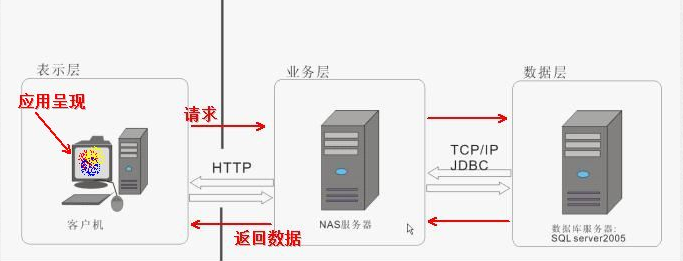

## 性能测试基础

* “状态”和“指派人”的对应关系如果更加细化，对项目而言是有益的：

  已关闭--->指派给修复这个bug的开发工程师。  
  无需解决，不是bug--->指派给提交这个bug的测试人员。  
  无需解决，迭代待解决--->指派给项目的产品经理。
* 如何实现对一个系统持续不段的加压
* 性能测试
  * 爆发力就是系统能承受的最大压力，没准系统承受的压力很大，但过半个小时之间就挂掉了。
  * 耐力就是这个系统长时间处于压力下的稳定性，这系统超级稳定，跑个几十年都不用重启服务器。
  * 整体协调性就是看系统有没系统瓶颈（短板），并对其进行系统调优。
* 一个测试用例应该包括：编号，标题，测试场景，测试步骤，预期结果。
* 响应时间过程分析：
  * 呈现时间：一般测试工具都屏蔽响应的呈现过程，只是模拟多用户并发请求，计算用户得到响应的时间，不会将服务器的每个响应做客户端渲染呈现
  * 数据传输时间：性能测试一般要在局域网中进行，在局域网中一般不会受到数据带宽的限制
  * 系统处理时间：性能测试主要就是验证系统的处理时间，因为前面的呈现时间和数据传输时间都是我们不可控制的

* 性能测试流程（一）——问清性能需求，解决为什么要性能测试？
  1. 新系统能力验证：可以有更多的自由选择测试环境、压力点和测试工具；测试策略上也比较灵活。
  1. 客户有明确要求
  1. 找出系统性能瓶颈：找出瓶颈的目的在于进行调优或硬件扩容，所以性能测试的重点在系统的架构分析和业务分析上面。
  1. 稳定性验证（强度测试）：比较典型的就是内存溢出，这种需求在测试策略上就要考虑性能测试的运行时长。
* 性能测试流程（二）——了解系统架构
  * 在环境搭建阶段，你需要了解项目的部署；在性能分析与调优阶段，更要深入这些技术的细节去分析。

    

* 性能测试流程（三）——分析测试点
  * 性能测试点的选取
    * 发生频率非常高的（例如：某邮箱核心业务系统中的登录、收发邮件等业务，它们在每天的业务总量中占到90%以上）
    * 关键程度非常高的（产品经理认为绝对不能出现问题的，如登录等）
    * 资源占用非常严重的（导致磁盘I/O非常大的，例如某个业务进行结果提交时需要向数十个表存取数据，或者一个查询提交请求时会检索出大量的数据记录）
  * 对性能需求点的描述：准确、一致、特定
* 性能测试流程（四）——测试工具选型
  * 只要能满足需求就可以
* 性能测试流程（五）——测试计划
  * 性能测试需求，寻找的被测试对象和压力点：几个典型的压力点——登录、查询、交易。
  * 测试环境：最好在一个相对独立的环境内进行，包括软件、硬件环境和网络环境。
  * 数据准备：历史数据分析有助于数据量级的确定。从其他相似或者相同系统入手，进行数据分析，找出高峰期数据量。
  * 测试工具
  * 测试策略：考虑最坏情况的原则、覆盖全面
* 性能测试流程（六）——测试环境搭建
  * 性能测试环境与功能测试环境的区别
  * 保证测试环境与生产环境的一致性
    1. 硬件环境，包括服务器环境、与网络环境
    1. 软件环境:版本，配置
    1. 使用场景的一致性：基础数据、使用模式
  * 实施策略(还是比较复杂的)
    1. 通过建模的方式实现低端硬件对高端硬件的模拟
    2. 通过集群的方式计算
* 性能测试流程（七）——测试执行
  * 准备测试数据
  * 使用测试工具模拟测试点，回放OK
  * 根据测试策略，使用不同的虚拟用户和测试组合 运行测试。
  * 监控系统CPU、内存、中间件，数据库的性能，收集数据。
  * 重复上两个步骤
* 性能测试流程（八）——性能调优
  * 步骤一：确定问题
    * 应用程序代码：在通常情况下，很多程序的性能问题都是写出来的，因此对于发现瓶颈的模块，应该首先检查一下代码。
    * 数据库配置：经常引起整个系统运行缓慢，一些诸如oracle 的大型数据库都是需要DBA进行正确的参数调整才能投产的。
    * 操作系统配置：不合理就可能引起系统瓶颈。
    * 硬件设置：硬盘速度、内存大小等都是容易引起瓶颈的原因，因此这些都是分析的重点。
    * 网络：网络负载过重导致网络冲突和网络延迟。
  * 步骤二：分析问题
    * 我们要明确这个问题影响的是响应时间吞吐量，还是其他问题？是多数用户还是少数用户遇到了问题？如果是少数用户，这几个用户与其它用户的操作有什么不用？系统资源监控的结果是否正常？CPU的使用是否到达极限？I/O 情况如何？问题是否集中在某一类模块中？ 是客户端还是服务器出现问题？ 系统硬件配置是否够用？实际负载是否超过了系统的负载能力？ 是否未对系统进行优化？
  * 步骤三： 确定调整目标和解决方案
  * 步骤四：测试解决方案
  * 步骤五：分析调优结果，不行重复

## selenium_python

* 同时设置了隐性等待和显性等待，在其他操作中，隐性等待起决定性作用，在WebDriverWait..中显性等待起主要作用，但要注意的是：最长的等待时间取决于两者之间的大者（所以有的时候比如校验必填项不能使用隐式等待，而使用显示等待比较麻烦）
* 窗口中看不到按钮使用click会报错，如果可以用回车代替
* 定位
  * [XPath 语法](http://www.w3school.com.cn/xpath/xpath_syntax.asp)
  * [使用 Xpath 对 XML 进行模糊查询](http://blog.csdn.net/yczz/article/details/45173599)
  * [xpath 相对当前节点定位方法总结](http://blog.csdn.net/leejeff/article/details/49737043)
    1. child 选取当前节点的所有子元素
    1. parent 选取当前节点的父节点
    1. descendant 选取当前节点的所有后代元素（子、孙等）
    1. ancestor 选取当前节点的所有先辈（父、祖父等）
    1. descendant-or-self 选取当前节点的所有后代元素（子、孙等）以及当前节点本身
    1. ancestor-or-self 选取当前节点的所有先辈（父、祖父等）以及当前节点本身
    1. preceding-sibling 选取当前节点之前的所有同级节点
    1. following-sibling 选取当前节点之后的所有同级节点
    1. preceding 选取文档中当前节点的开始标签之前的所有节点
    1. following 选取文档中当前节点的结束标签之后的所有节点
    1. self 选取当前节点
    1. attribute 选取当前节点的所有属性
    1. namespace 选取当前节点的所有命名空间节点
    
    如：要定位当前 td 同级后的一个 td

        //td[.='text']/following-sibling::td
  * 修改属性：[【Selenium】如何修改只读（readonly属性）元素的值](http://www.jianshu.com/p/cb8ee5321712)
  * 获得属性：[Selenium2+python自动化35-获取元素属性](https://www.cnblogs.com/yoyoketang/p/6486927.html)

* 还需要解决
  * 鼠标的复杂操作：按住-拖动，失去焦点
  * 密码输入
  * 具体写断言
  * 一组元素的赋值
  * 网页截图（比窗口大）
  * 如何后台执行

## 接口测试
* 接口测试实际上是黑盒测试，基本的测试思路是通过输入和输出判断被测系统或者对象的逻辑
* 测试用例编写还是 3a 原则：
  * A: arrange 初始化测试数据，就是造数据；
  * A: act 调用接口，传入输入数据，并得到返回；
  * A: assert 断言，对返回的资源信息进行断言
* 接口分析
  * 接口的协议：比如说 https 协议；
  * 请求的方法：比如说 GET;
  * 请求参数：http协议里规定了请求的时候可以传递一些参数给服务端，这些参数可以更加具体的描述资源，比如获取多少个资源，这个资源的名字是什么。上面的例子里，我们可以传递name参数指定资源的名称，比如获取名字叫python的资源，这里资源就是节点；
  * 鉴权：简单来说，就是要不要登录，很显然，上面的接口是不需要登录的